Materi-1
================

## Library/Packages

*Package* R yang akan digunakan pada perkuliahan Analisis Deret Waktu
sesi UTS adalah: `forecast`, `graphics`, `TTR`, `TSA` . Jika *package*
tersebut belum ada, silakan install terlebih dahulu.

``` r
#install.packages("forecast")
# install.packages("graphics")
# install.packages("TTR")
# install.packages("TSA")
```

Jika sudah ada, silakan panggil library *package* tersebut.

``` r
library("forecast")
```

    ## Warning: package 'forecast' was built under R version 4.5.3

``` r
library("graphics")
library("TTR")
```

    ## Warning: package 'TTR' was built under R version 4.5.3

``` r
library("TSA")
```

    ## Warning: package 'TSA' was built under R version 4.5.3

    ## Registered S3 methods overwritten by 'TSA':
    ##   method       from    
    ##   fitted.Arima forecast
    ##   plot.Arima   forecast

    ## 
    ## Attaching package: 'TSA'

    ## The following objects are masked from 'package:stats':
    ## 
    ##     acf, arima

    ## The following object is masked from 'package:utils':
    ## 
    ##     tar

## Impor Data

``` r
library(rio) #install packages jika belum ada
```

    ## Warning: package 'rio' was built under R version 4.5.3

``` r
data1 <- import("Data_1.csv")
data2 <- import("Data_2.csv")

#via csv gunakan read.csv("namafile.csv")
#data1 <- read.csv("Data_1.csv")

# menampilkan 5 data pertama
head(data1)
```

    ##   Periode   Yt
    ## 1       1 48.7
    ## 2       2 45.8
    ## 3       3 46.4
    ## 4       4 46.2
    ## 5       5 44.0
    ## 6       6 53.8

``` r
head(data2)
```

    ##   Period   Sales
    ## 1      1 10618.1
    ## 2      2 10537.9
    ## 3      3 10209.3
    ## 4      4 10553.0
    ## 5      5  9934.9
    ## 6      6 10534.5

## Eksplorasi Data

`View()` : menampilkan data dalam bentuk tabel, `str()` : menampilkan
struktur data, `dim()` : menampilkan dimensi data

``` r
View(data1)
str(data1)
```

    ## 'data.frame':    50 obs. of  2 variables:
    ##  $ Periode: int  1 2 3 4 5 6 7 8 9 10 ...
    ##  $ Yt     : num  48.7 45.8 46.4 46.2 44 53.8 47.6 47 47.6 51.1 ...

``` r
dim(data1)
```

    ## [1] 50  2

``` r
View(data2)
str(data2)
```

    ## 'data.frame':    120 obs. of  2 variables:
    ##  $ Period: int  1 2 3 4 5 6 7 8 9 10 ...
    ##  $ Sales : num  10618 10538 10209 10553 9935 ...

``` r
dim(data2)
```

    ## [1] 120   2

Mengubah data agar terbaca sebagai data deret waktu dengan fungsi `ts()`
.

``` r
data1.ts <- ts(data1$Yt)
data2.ts <- ts(data2$Sales)
```

Menampilkan ringkasan data

``` r
summary(data1.ts)
```

    ##    Min. 1st Qu.  Median    Mean 3rd Qu.    Max. 
    ##   43.30   46.40   48.65   48.92   51.55   54.80

``` r
summary(data2.ts)
```

    ##    Min. 1st Qu.  Median    Mean 3rd Qu.    Max. 
    ##    9815   10210   10392   10379   10535   10827

Membuat plot data deret waktu

``` r
ts.plot(data1.ts, xlab="Time Period ", ylab="Reading", 
        main = "Time Series Plot")
points(data1.ts)
```

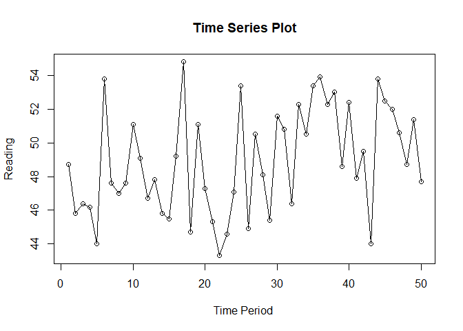<!-- -->

``` r
#menyimpan plot
dev.copy(png, "plot_data1.png")
```

    ## png 
    ##   3

``` r
dev.off()
```

    ## png 
    ##   2

``` r
ts.plot(data2.ts, xlab="Time Period ", ylab="Sales", 
        main = "Time Series Plot of Sales")
points(data2.ts)
```

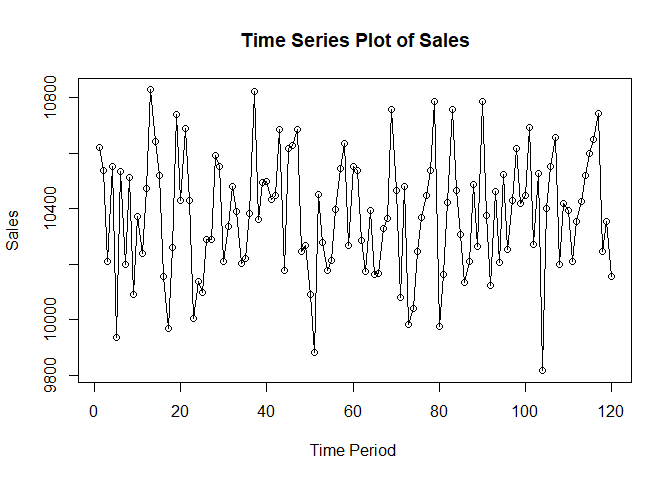<!-- -->

``` r
#menyimpan plot
dev.copy(png, "plot_data2.png")
```

    ## png 
    ##   3

``` r
dev.off()
```

    ## png 
    ##   2

## Moving Average

### Pembagian Data

Pembagian data latih dan data uji dilakukan dengan perbandingan 80% data
latih dan 20% data uji.

``` r
# hitung jumlah data
n <- nrow(data2)

# tentukan batas 80%
n_train <- floor(0.8 * n)

# bagi data
training_ma <- data2[1:n_train, ]
testing_ma  <- data2[(n_train+1):n, ]

# ubah ke time series
train_ma.ts <- ts(training_ma$Sales)
test_ma.ts  <- ts(testing_ma$Sales)
```

Eksplorasi data dilakukan pada keseluruhan data, data latih serta data
uji menggunakan plot data deret waktu.

``` r
#eksplorasi keseluruhan data
plot(data2.ts, col="red",main="Plot semua data")
points(data2.ts)
```

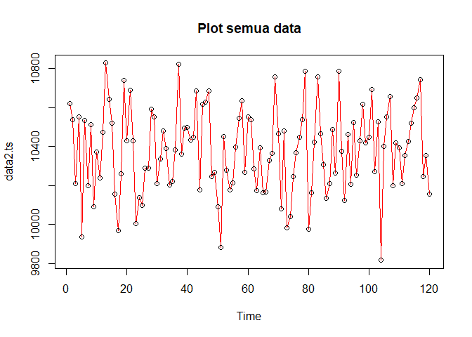<!-- -->

``` r
#eksplorasi data latih
plot(train_ma.ts, col="blue",main="Plot data latih")
points(train_ma.ts)
```

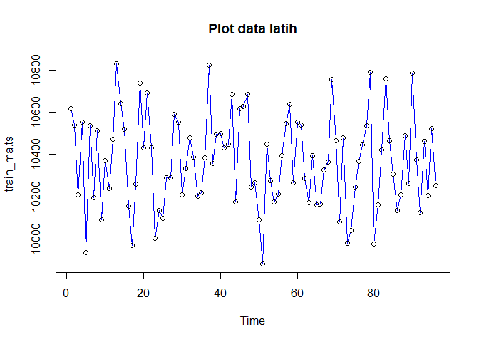<!-- -->

``` r
#eksplorasi data uji
plot(test_ma.ts, col="blue",main="Plot data uji")
points(test_ma.ts)
```

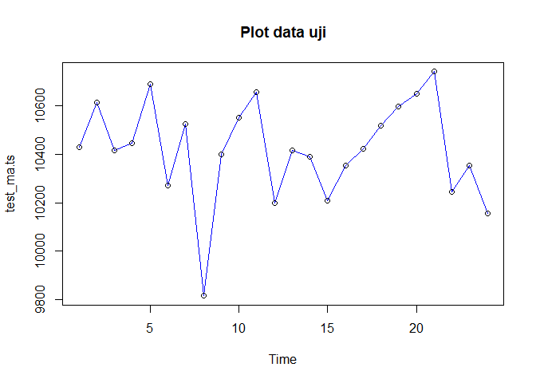<!-- -->

Eksplorasi data juga dapat dilakukan menggunakan package `ggplot2`
dengan terlebih dahulu memanggil library *package* `ggplot2`.

``` r
library(ggplot2)
```

    ## Warning: package 'ggplot2' was built under R version 4.5.3

``` r
ggplot() + 
  geom_line(data = training_ma, aes(x = Period, y = Sales, col = "Data Latih")) +
  geom_line(data = testing_ma, aes(x = Period, y = Sales, col = "Data Uji")) +
  labs(x = "Periode Waktu", y = "Sales", color = "Legend") +
   scale_colour_manual(name="Keterangan:", breaks = c("Data Latih", "Data Uji"),
                      values = c("blue", "red")) + 
  theme_bw() + theme(legend.position = "bottom",
                     plot.caption = element_text(hjust=0.5, size=12))
```

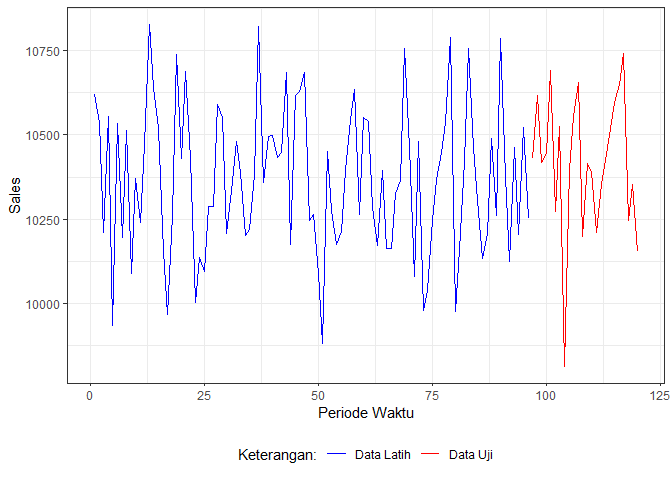<!-- -->

### Single Moving Average (SMA)

Ide dasar dari Single Moving Average (SMA) adalah data suatu periode
dipengaruhi oleh data periode sebelumnya. Metode pemulusan ini cocok
digunakan untuk pola data stasioner atau konstan. Prinsip dasar metode
pemulusan ini adalah data pemulusan pada periode ke-t merupakan rata
rata dari m buah data pada periode ke-t hingga periode ke (t-m+1).


Data pemulusan pada periode ke-t selanjutnya digunakan sebagai nilai
peramalan pada periode ke t+1.


Pemulusan menggunakan metode SMA dilakukan dengan fungsi `SMA()`. Dalam
hal ini akan dilakukan pemulusan dengan parameter `m=4`.

``` r
data.sma<-SMA(train_ma.ts, n=4)
data.sma
```

    ## Time Series:
    ## Start = 1 
    ## End = 96 
    ## Frequency = 1 
    ##  [1]       NA       NA       NA 10479.58 10308.78 10307.93 10304.73 10294.43
    ##  [9] 10333.10 10292.28 10303.00 10293.15 10477.55 10544.95 10614.55 10535.00
    ## [17] 10320.50 10225.40 10280.20 10349.15 10529.10 10571.60 10387.95 10314.38
    ## [25] 10166.18 10130.75 10202.43 10315.98 10429.90 10409.80 10421.15 10393.70
    ## [33] 10352.63 10351.20 10322.40 10298.05 10406.28 10445.30 10514.13 10542.85
    ## [41] 10445.60 10467.88 10515.33 10435.05 10481.18 10526.15 10526.05 10543.60
    ## [49] 10455.85 10321.53 10120.80 10171.55 10174.38 10195.58 10278.43 10264.88
    ## [57] 10332.28 10447.40 10460.58 10499.60 10497.68 10410.30 10386.83 10347.20
    ## [65] 10253.23 10222.80 10261.73 10254.73 10403.13 10477.90 10416.28 10444.90
    ## [73] 10251.15 10145.05 10186.45 10158.55 10274.90 10398.93 10534.13 10436.08
    ## [81] 10364.73 10336.43 10329.00 10451.00 10487.53 10415.68 10278.30 10284.35
    ## [89] 10273.18 10435.98 10477.90 10386.75 10436.85 10291.75 10328.58 10361.03

Data pemulusan pada periode ke-t selanjutnya digunakan sebagai nilai
peramalan pada periode ke t+1 sehingga hasil peramalan 1 periode kedepan
adalah sebagai berikut.

``` r
data.ramal<-c(NA,data.sma)
data.ramal #forecast 1 periode ke depan
```

    ##  [1]       NA       NA       NA       NA 10479.58 10308.78 10307.93 10304.73
    ##  [9] 10294.43 10333.10 10292.28 10303.00 10293.15 10477.55 10544.95 10614.55
    ## [17] 10535.00 10320.50 10225.40 10280.20 10349.15 10529.10 10571.60 10387.95
    ## [25] 10314.38 10166.18 10130.75 10202.43 10315.98 10429.90 10409.80 10421.15
    ## [33] 10393.70 10352.63 10351.20 10322.40 10298.05 10406.28 10445.30 10514.13
    ## [41] 10542.85 10445.60 10467.88 10515.33 10435.05 10481.18 10526.15 10526.05
    ## [49] 10543.60 10455.85 10321.53 10120.80 10171.55 10174.38 10195.58 10278.43
    ## [57] 10264.88 10332.28 10447.40 10460.58 10499.60 10497.68 10410.30 10386.83
    ## [65] 10347.20 10253.23 10222.80 10261.73 10254.73 10403.13 10477.90 10416.28
    ## [73] 10444.90 10251.15 10145.05 10186.45 10158.55 10274.90 10398.93 10534.13
    ## [81] 10436.08 10364.73 10336.43 10329.00 10451.00 10487.53 10415.68 10278.30
    ## [89] 10284.35 10273.18 10435.98 10477.90 10386.75 10436.85 10291.75 10328.58
    ## [97] 10361.03

Selanjutnya dilakukan peramalan sebanyak 24 periode sesuai dengan jumlah
data uji. Pada metode SMA, seluruh hasil peramalan untuk 24 periode ke
depan akan memiliki nilai yang sama dengan hasil ramalan satu periode ke
depan.

``` r
data.gab<-cbind(
  aktual=c(data2.ts),
  pemulusan=c(data.sma,rep(NA,24)),
  ramalan=c(data.ramal,rep(data.ramal[length(data.ramal)],23)))

data.gab #forecast 24 periode ke depan
```

    ##         aktual pemulusan  ramalan
    ##   [1,] 10618.1        NA       NA
    ##   [2,] 10537.9        NA       NA
    ##   [3,] 10209.3        NA       NA
    ##   [4,] 10553.0  10479.58       NA
    ##   [5,]  9934.9  10308.78 10479.58
    ##   [6,] 10534.5  10307.93 10308.78
    ##   [7,] 10196.5  10304.73 10307.93
    ##   [8,] 10511.8  10294.43 10304.73
    ##   [9,] 10089.6  10333.10 10294.43
    ##  [10,] 10371.2  10292.28 10333.10
    ##  [11,] 10239.4  10303.00 10292.28
    ##  [12,] 10472.4  10293.15 10303.00
    ##  [13,] 10827.2  10477.55 10293.15
    ##  [14,] 10640.8  10544.95 10477.55
    ##  [15,] 10517.8  10614.55 10544.95
    ##  [16,] 10154.2  10535.00 10614.55
    ##  [17,]  9969.2  10320.50 10535.00
    ##  [18,] 10260.4  10225.40 10320.50
    ##  [19,] 10737.0  10280.20 10225.40
    ##  [20,] 10430.0  10349.15 10280.20
    ##  [21,] 10689.0  10529.10 10349.15
    ##  [22,] 10430.4  10571.60 10529.10
    ##  [23,] 10002.4  10387.95 10571.60
    ##  [24,] 10135.7  10314.38 10387.95
    ##  [25,] 10096.2  10166.18 10314.38
    ##  [26,] 10288.7  10130.75 10166.18
    ##  [27,] 10289.1  10202.43 10130.75
    ##  [28,] 10589.9  10315.98 10202.43
    ##  [29,] 10551.9  10429.90 10315.98
    ##  [30,] 10208.3  10409.80 10429.90
    ##  [31,] 10334.5  10421.15 10409.80
    ##  [32,] 10480.1  10393.70 10421.15
    ##  [33,] 10387.6  10352.63 10393.70
    ##  [34,] 10202.6  10351.20 10352.63
    ##  [35,] 10219.3  10322.40 10351.20
    ##  [36,] 10382.7  10298.05 10322.40
    ##  [37,] 10820.5  10406.28 10298.05
    ##  [38,] 10358.7  10445.30 10406.28
    ##  [39,] 10494.6  10514.13 10445.30
    ##  [40,] 10497.6  10542.85 10514.13
    ##  [41,] 10431.5  10445.60 10542.85
    ##  [42,] 10447.8  10467.88 10445.60
    ##  [43,] 10684.4  10515.33 10467.88
    ##  [44,] 10176.5  10435.05 10515.33
    ##  [45,] 10616.0  10481.18 10435.05
    ##  [46,] 10627.7  10526.15 10481.18
    ##  [47,] 10684.0  10526.05 10526.15
    ##  [48,] 10246.7  10543.60 10526.05
    ##  [49,] 10265.0  10455.85 10543.60
    ##  [50,] 10090.4  10321.53 10455.85
    ##  [51,]  9881.1  10120.80 10321.53
    ##  [52,] 10449.7  10171.55 10120.80
    ##  [53,] 10276.3  10174.38 10171.55
    ##  [54,] 10175.2  10195.58 10174.38
    ##  [55,] 10212.5  10278.43 10195.58
    ##  [56,] 10395.5  10264.88 10278.43
    ##  [57,] 10545.9  10332.28 10264.88
    ##  [58,] 10635.7  10447.40 10332.28
    ##  [59,] 10265.2  10460.58 10447.40
    ##  [60,] 10551.6  10499.60 10460.58
    ##  [61,] 10538.2  10497.68 10499.60
    ##  [62,] 10286.2  10410.30 10497.68
    ##  [63,] 10171.3  10386.83 10410.30
    ##  [64,] 10393.1  10347.20 10386.83
    ##  [65,] 10162.3  10253.23 10347.20
    ##  [66,] 10164.5  10222.80 10253.23
    ##  [67,] 10327.0  10261.73 10222.80
    ##  [68,] 10365.1  10254.73 10261.73
    ##  [69,] 10755.9  10403.13 10254.73
    ##  [70,] 10463.6  10477.90 10403.13
    ##  [71,] 10080.5  10416.28 10477.90
    ##  [72,] 10479.6  10444.90 10416.28
    ##  [73,]  9980.9  10251.15 10444.90
    ##  [74,] 10039.2  10145.05 10251.15
    ##  [75,] 10246.1  10186.45 10145.05
    ##  [76,] 10368.0  10158.55 10186.45
    ##  [77,] 10446.3  10274.90 10158.55
    ##  [78,] 10535.3  10398.93 10274.90
    ##  [79,] 10786.9  10534.13 10398.93
    ##  [80,]  9975.8  10436.08 10534.13
    ##  [81,] 10160.9  10364.73 10436.08
    ##  [82,] 10422.1  10336.43 10364.73
    ##  [83,] 10757.2  10329.00 10336.43
    ##  [84,] 10463.8  10451.00 10329.00
    ##  [85,] 10307.0  10487.53 10451.00
    ##  [86,] 10134.7  10415.68 10487.53
    ##  [87,] 10207.7  10278.30 10415.68
    ##  [88,] 10488.0  10284.35 10278.30
    ##  [89,] 10262.3  10273.18 10284.35
    ##  [90,] 10785.9  10435.98 10273.18
    ##  [91,] 10375.4  10477.90 10435.98
    ##  [92,] 10123.4  10386.75 10477.90
    ##  [93,] 10462.7  10436.85 10386.75
    ##  [94,] 10205.5  10291.75 10436.85
    ##  [95,] 10522.7  10328.58 10291.75
    ##  [96,] 10253.2  10361.03 10328.58
    ##  [97,] 10428.7        NA 10361.03
    ##  [98,] 10615.8        NA 10361.03
    ##  [99,] 10417.3        NA 10361.03
    ## [100,] 10445.4        NA 10361.03
    ## [101,] 10690.6        NA 10361.03
    ## [102,] 10271.8        NA 10361.03
    ## [103,] 10524.8        NA 10361.03
    ## [104,]  9815.0        NA 10361.03
    ## [105,] 10398.5        NA 10361.03
    ## [106,] 10553.1        NA 10361.03
    ## [107,] 10655.8        NA 10361.03
    ## [108,] 10199.1        NA 10361.03
    ## [109,] 10416.6        NA 10361.03
    ## [110,] 10391.3        NA 10361.03
    ## [111,] 10210.1        NA 10361.03
    ## [112,] 10352.5        NA 10361.03
    ## [113,] 10423.8        NA 10361.03
    ## [114,] 10519.3        NA 10361.03
    ## [115,] 10596.7        NA 10361.03
    ## [116,] 10650.0        NA 10361.03
    ## [117,] 10741.6        NA 10361.03
    ## [118,] 10246.0        NA 10361.03
    ## [119,] 10354.4        NA 10361.03
    ## [120,] 10155.4        NA 10361.03

Adapun plot data deret waktu dari hasil peramalan yang dilakukan adalah
sebagai berikut.

``` r
ts.plot(data2.ts, xlab="Time Period ", ylab="Sales", main= "SMA N=4 Data Sales")
points(data2.ts)
lines(data.gab[,2],col="green",lwd=2)
lines(data.gab[,3],col="red",lwd=2)
legend("topleft",c("data aktual","data pemulusan","data peramalan"), lty=8, col=c("black","green","red"), cex=0.5)
```

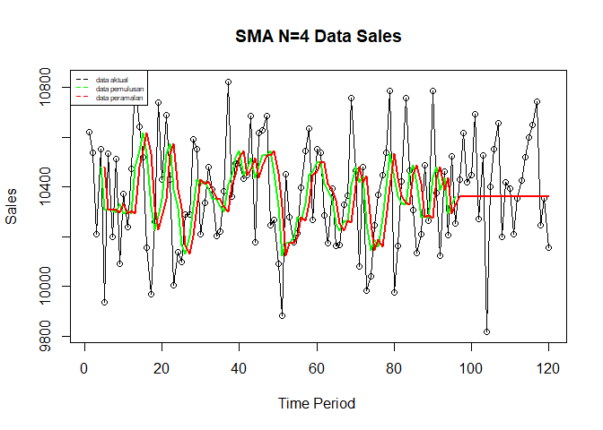<!-- -->

Selanjutnya perhitungan akurasi dilakukan dengan ukuran akurasi *Sum
Squares Error* (SSE), *Mean Square Error* (MSE) dan *Mean Absolute
Percentage Error* (MAPE). Perhitungan akurasi dilakukan baik pada data
latih maupun pada data uji.

^2")

^2")


#### Akurasi Data Latih

``` r
#Menghitung nilai keakuratan data latih
error_train.sma = train_ma.ts-data.ramal[1:length(train_ma.ts)]

SSE_train.sma = sum(error_train.sma[5:length(train_ma.ts)]^2)
MSE_train.sma = mean(error_train.sma[5:length(train_ma.ts)]^2)
MAPE_train.sma = mean(abs((error_train.sma[5:length(train_ma.ts)]/train_ma.ts[5:length(train_ma.ts)])*100))

akurasi_train.sma <- matrix(c(SSE_train.sma, MSE_train.sma, MAPE_train.sma))
row.names(akurasi_train.sma)<- c("SSE", "MSE", "MAPE")
colnames(akurasi_train.sma) <- c("Akurasi m = 4")
akurasi_train.sma
```

    ##      Akurasi m = 4
    ## SSE   6.396116e+06
    ## MSE   6.952300e+04
    ## MAPE  2.049321e+00

Dalam hal ini nilai MAPE data latih pada metode pemulusan SMA sekitar
2%, nilai ini dapat dikategorikan sebagai nilai akurasi yang sangat
baik. Selanjutnya dilakukan perhitungan nilai MAPE data uji pada metode
pemulusan SMA.

#### Akurasi Data Uji

``` r
#Menghitung nilai keakuratan data uji
error_test.sma = test_ma.ts-data.gab[97:120,3]

SSE_test.sma = sum(error_test.sma^2)
MSE_test.sma = mean(error_test.sma^2)
MAPE_test.sma = mean(abs((error_test.sma/test_ma.ts*100)))

akurasi_test.sma <- matrix(c(SSE_test.sma, MSE_test.sma, MAPE_test.sma))
row.names(akurasi_test.sma)<- c("SSE", "MSE", "MAPE")
colnames(akurasi_test.sma) <- c("Akurasi m = 4")
akurasi_test.sma
```

    ##      Akurasi m = 4
    ## SSE   1.068022e+06
    ## MSE   4.450094e+04
    ## MAPE  1.591089e+00

Perhitungan akurasi menggunakan data latih menghasilkan nilai MAPE yang
kurang dari 10% sehingga nilai akurasi ini dapat dikategorikan sebagai
sangat baik.

### Double Moving Average (DMA)

Metode pemulusan Double Moving Average (DMA) pada dasarnya mirip dengan
SMA. Namun demikian, metode ini lebih cocok digunakan untuk pola data
trend. Proses pemulusan dengan rata rata dalam metode ini dilakukan
sebanyak 2 kali.

- **Tahap I:**


- **Tahap II:**


Forecast  langkah ke
depan dihitung dengan:

")

dengan komponen level
() dan tren
():

")

``` r
dma <- SMA(data.sma, n = 4)
At <- 2*data.sma - dma
Bt <- 2/(4-1)*(data.sma - dma)
data.dma<- At+Bt
data.ramal2<- c(NA, data.dma)

t = 1:24
f = c()

for (i in t) {
  f[i] = At[length(At)] + Bt[length(Bt)]*(i)
}

data.gab2 <- cbind(aktual = c(data2.ts), 
                   pemulusan1 = c(data.sma,rep(NA,24)),
                   pemulusan2 = c(dma, rep(NA,24)),
                   At = c(At, rep(NA,24)), 
                   Bt = c(Bt,rep(NA,24)),
                   ramalan = c(data.ramal2, f[-1]))
data.gab2
```

    ##         aktual pemulusan1 pemulusan2        At           Bt   ramalan
    ##   [1,] 10618.1         NA         NA        NA           NA        NA
    ##   [2,] 10537.9         NA         NA        NA           NA        NA
    ##   [3,] 10209.3         NA         NA        NA           NA        NA
    ##   [4,] 10553.0   10479.58         NA        NA           NA        NA
    ##   [5,]  9934.9   10308.78         NA        NA           NA        NA
    ##   [6,] 10534.5   10307.93         NA        NA           NA        NA
    ##   [7,] 10196.5   10304.73   10350.25 10259.200  -30.3500000        NA
    ##   [8,] 10511.8   10294.43   10303.96 10284.888   -6.3583333 10228.850
    ##   [9,] 10089.6   10333.10   10310.04 10356.156   15.3708333 10278.529
    ##  [10,] 10371.2   10292.28   10306.13 10278.419   -9.2375000 10371.527
    ##  [11,] 10239.4   10303.00   10305.70 10300.300   -1.8000000 10269.181
    ##  [12,] 10472.4   10293.15   10305.38 10280.919   -8.1541667 10298.500
    ##  [13,] 10827.2   10477.55   10341.49 10613.606   90.7041667 10272.765
    ##  [14,] 10640.8   10544.95   10404.66 10685.238   93.5250000 10704.310
    ##  [15,] 10517.8   10614.55   10482.55 10746.550   88.0000000 10778.763
    ##  [16,] 10154.2   10535.00   10543.01 10526.988   -5.3416667 10834.550
    ##  [17,]  9969.2   10320.50   10503.75 10137.250 -122.1666667 10521.646
    ##  [18,] 10260.4   10225.40   10423.86 10026.938 -132.3083333 10015.083
    ##  [19,] 10737.0   10280.20   10340.28 10220.125  -40.0500000  9894.629
    ##  [20,] 10430.0   10349.15   10293.81 10404.488   36.8916667 10180.075
    ##  [21,] 10689.0   10529.10   10345.96 10712.238  122.0916667 10441.379
    ##  [22,] 10430.4   10571.60   10432.51 10710.688   92.7250000 10834.329
    ##  [23,] 10002.4   10387.95   10459.45 10316.450  -47.6666667 10803.413
    ##  [24,] 10135.7   10314.38   10450.76 10177.994  -90.9208333 10268.783
    ##  [25,] 10096.2   10166.18   10360.03  9972.325 -129.2333333 10087.073
    ##  [26,] 10288.7   10130.75   10249.81 10011.688  -79.3750000  9843.092
    ##  [27,] 10289.1   10202.43   10203.43 10201.419   -0.6708333  9932.313
    ##  [28,] 10589.9   10315.98   10203.83 10428.119   74.7625000 10200.748
    ##  [29,] 10551.9   10429.90   10269.76 10590.038  106.7583333 10502.881
    ##  [30,] 10208.3   10409.80   10339.53 10480.075   46.8500000 10696.796
    ##  [31,] 10334.5   10421.15   10394.21 10448.094   17.9625000 10526.925
    ##  [32,] 10480.1   10393.70   10413.64 10373.763  -13.2916667 10466.056
    ##  [33,] 10387.6   10352.63   10394.32 10310.931  -27.7958333 10360.471
    ##  [34,] 10202.6   10351.20   10379.67 10322.731  -18.9791667 10283.135
    ##  [35,] 10219.3   10322.40   10354.98 10289.819  -21.7208333 10303.752
    ##  [36,] 10382.7   10298.05   10331.07 10265.031  -22.0125000 10268.098
    ##  [37,] 10820.5   10406.28   10344.48 10468.069   41.1958333 10243.019
    ##  [38,] 10358.7   10445.30   10368.01 10522.594   51.5291667 10509.265
    ##  [39,] 10494.6   10514.13   10415.94 10612.313   65.4583333 10574.123
    ##  [40,] 10497.6   10542.85   10477.14 10608.563   43.8083333 10677.771
    ##  [41,] 10431.5   10445.60   10486.97 10404.231  -27.5791667 10652.371
    ##  [42,] 10447.8   10467.88   10492.61 10443.138  -16.4916667 10376.652
    ##  [43,] 10684.4   10515.33   10492.91 10537.738   14.9416667 10426.646
    ##  [44,] 10176.5   10435.05   10465.96 10404.138  -20.6083333 10552.679
    ##  [45,] 10616.0   10481.18   10474.86 10487.494    4.2125000 10383.529
    ##  [46,] 10627.7   10526.15   10489.42 10562.875   24.4833333 10491.706
    ##  [47,] 10684.0   10526.05   10492.11 10559.994   22.6291667 10587.358
    ##  [48,] 10246.7   10543.60   10519.24 10567.956   16.2375000 10582.623
    ##  [49,] 10265.0   10455.85   10512.91 10398.788  -38.0416667 10584.194
    ##  [50,] 10090.4   10321.53   10461.76 10181.294  -93.4875000 10360.746
    ##  [51,]  9881.1   10120.80   10360.44  9881.156 -159.7625000 10087.806
    ##  [52,] 10449.7   10171.55   10267.43 10075.669  -63.9208333  9721.394
    ##  [53,] 10276.3   10174.38   10197.06 10151.688  -15.1250000 10011.748
    ##  [54,] 10175.2   10195.58   10165.57 10225.575   20.0000000 10136.563
    ##  [55,] 10212.5   10278.43   10204.98 10351.869   48.9625000 10245.575
    ##  [56,] 10395.5   10264.88   10228.31 10301.438   24.3750000 10400.831
    ##  [57,] 10545.9   10332.28   10267.79 10396.763   42.9916667 10325.813
    ##  [58,] 10635.7   10447.40   10330.74 10564.056   77.7708333 10439.754
    ##  [59,] 10265.2   10460.58   10376.28 10544.869   56.1958333 10641.827
    ##  [60,] 10551.6   10499.60   10434.96 10564.238   43.0916667 10601.065
    ##  [61,] 10538.2   10497.68   10476.31 10519.038   14.2416667 10607.329
    ##  [62,] 10286.2   10410.30   10467.04 10353.563  -37.8250000 10533.279
    ##  [63,] 10171.3   10386.83   10448.60 10325.050  -41.1833333 10315.738
    ##  [64,] 10393.1   10347.20   10410.50 10283.900  -42.2000000 10283.867
    ##  [65,] 10162.3   10253.23   10349.39 10157.063  -64.1083333 10241.700
    ##  [66,] 10164.5   10222.80   10302.51 10143.088  -53.1416667 10092.954
    ##  [67,] 10327.0   10261.73   10271.24 10252.213   -6.3416667 10089.946
    ##  [68,] 10365.1   10254.73   10248.12 10261.331    4.4041667 10245.871
    ##  [69,] 10755.9   10403.13   10285.59 10520.656   78.3541667 10265.735
    ##  [70,] 10463.6   10477.90   10349.37 10606.431   85.6875000 10599.010
    ##  [71,] 10080.5   10416.28   10388.01 10444.544   18.8458333 10692.119
    ##  [72,] 10479.6   10444.90   10435.55 10454.250    6.2333333 10463.390
    ##  [73,]  9980.9   10251.15   10397.56 10104.744  -97.6041667 10460.483
    ##  [74,] 10039.2   10145.05   10314.34  9975.756 -112.8625000 10007.140
    ##  [75,] 10246.1   10186.45   10256.89 10116.013  -46.9583333  9862.894
    ##  [76,] 10368.0   10158.55   10185.30 10131.800  -17.8333333 10069.054
    ##  [77,] 10446.3   10274.90   10191.24 10358.563   55.7750000 10113.967
    ##  [78,] 10535.3   10398.93   10254.71 10543.144   96.1458333 10414.338
    ##  [79,] 10786.9   10534.13   10341.63 10726.625  128.3333333 10639.290
    ##  [80,]  9975.8   10436.08   10411.01 10461.144   16.7125000 10854.958
    ##  [81,] 10160.9   10364.73   10433.46 10295.988  -45.8250000 10477.856
    ##  [82,] 10422.1   10336.43   10417.84 10255.013  -54.2750000 10250.163
    ##  [83,] 10757.2   10329.00   10366.56 10291.444  -25.0375000 10200.738
    ##  [84,] 10463.8   10451.00   10370.29 10531.713   53.8083333 10266.406
    ##  [85,] 10307.0   10487.53   10400.99 10574.063   57.6916667 10585.521
    ##  [86,] 10134.7   10415.68   10420.80 10410.550   -3.4166667 10631.754
    ##  [87,] 10207.7   10278.30   10408.13 10148.475  -86.5500000 10407.133
    ##  [88,] 10488.0   10284.35   10366.46 10202.238  -54.7416667 10061.925
    ##  [89,] 10262.3   10273.18   10312.88 10233.475  -26.4666667 10147.496
    ##  [90,] 10785.9   10435.98   10317.95 10554.000   78.6833333 10207.008
    ##  [91,] 10375.4   10477.90   10367.85 10587.950   73.3666667 10632.683
    ##  [92,] 10123.4   10386.75   10393.45 10380.050   -4.4666667 10661.317
    ##  [93,] 10462.7   10436.85   10434.37 10439.331    1.6541667 10375.583
    ##  [94,] 10205.5   10291.75   10398.31 10185.188  -71.0416667 10440.985
    ##  [95,] 10522.7   10328.58   10360.98 10296.169  -21.6041667 10114.146
    ##  [96,] 10253.2   10361.03   10354.55 10367.500    4.3166667 10274.565
    ##  [97,] 10428.7         NA         NA        NA           NA 10371.817
    ##  [98,] 10615.8         NA         NA        NA           NA 10376.133
    ##  [99,] 10417.3         NA         NA        NA           NA 10380.450
    ## [100,] 10445.4         NA         NA        NA           NA 10384.767
    ## [101,] 10690.6         NA         NA        NA           NA 10389.083
    ## [102,] 10271.8         NA         NA        NA           NA 10393.400
    ## [103,] 10524.8         NA         NA        NA           NA 10397.717
    ## [104,]  9815.0         NA         NA        NA           NA 10402.033
    ## [105,] 10398.5         NA         NA        NA           NA 10406.350
    ## [106,] 10553.1         NA         NA        NA           NA 10410.667
    ## [107,] 10655.8         NA         NA        NA           NA 10414.983
    ## [108,] 10199.1         NA         NA        NA           NA 10419.300
    ## [109,] 10416.6         NA         NA        NA           NA 10423.617
    ## [110,] 10391.3         NA         NA        NA           NA 10427.933
    ## [111,] 10210.1         NA         NA        NA           NA 10432.250
    ## [112,] 10352.5         NA         NA        NA           NA 10436.567
    ## [113,] 10423.8         NA         NA        NA           NA 10440.883
    ## [114,] 10519.3         NA         NA        NA           NA 10445.200
    ## [115,] 10596.7         NA         NA        NA           NA 10449.517
    ## [116,] 10650.0         NA         NA        NA           NA 10453.833
    ## [117,] 10741.6         NA         NA        NA           NA 10458.150
    ## [118,] 10246.0         NA         NA        NA           NA 10462.467
    ## [119,] 10354.4         NA         NA        NA           NA 10466.783
    ## [120,] 10155.4         NA         NA        NA           NA 10471.100

Hasil pemulusan menggunakan metode DMA divisualisasikan sebagai berikut

``` r
ts.plot(data2.ts, xlab="Time Period ", ylab="Sales", main= "DMA N=4 Data Sales")
points(data2.ts)
lines(data.gab2[,3],col="green",lwd=2)
lines(data.gab2[,6],col="red",lwd=2)
legend("topleft",c("data aktual","data pemulusan","data peramalan"), lty=8, col=c("black","green","red"), cex=0.8)
```

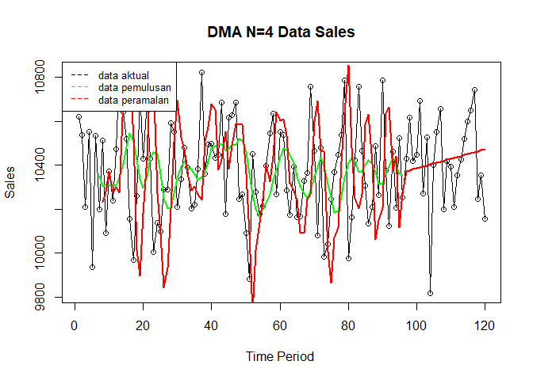<!-- -->

Selanjutnya perhitungan akurasi dilakukan baik pada data latih maupun
data uji. Perhitungan akurasi dilakukan dengan ukuran akurasi SSE, MSE
dan MAPE.

#### Akurasi Data Latih

``` r
#Menghitung nilai keakuratan data latih
error_train.dma = train_ma.ts-data.ramal2[1:length(train_ma.ts)]

SSE_train.dma = sum(error_train.dma[8:length(train_ma.ts)]^2)
MSE_train.dma = mean(error_train.dma[8:length(train_ma.ts)]^2)
MAPE_train.dma = mean(abs((error_train.dma[8:length(train_ma.ts)]/train_ma.ts[8:length(train_ma.ts)])*100))

akurasi_train.dma <- matrix(c(SSE_train.dma, MSE_train.dma, MAPE_train.dma))
row.names(akurasi_train.dma)<- c("SSE", "MSE", "MAPE")
colnames(akurasi_train.dma) <- c("Akurasi m = 4")
akurasi_train.dma
```

    ##      Akurasi m = 4
    ## SSE   9.856243e+06
    ## MSE   1.107443e+05
    ## MAPE  2.524911e+00

Perhitungan akurasi pada data latih menggunakan nilai MAPE menghasilkan
nilai MAPE yang kurang dari 10% sehingga dikategorikan sangat baik.
Selanjutnya, perhitungan nilai akurasi dilakukan pada data uji.

#### Akurasi Data Uji

``` r
#Menghitung nilai keakuratan data uji
error_test.dma = test_ma.ts-data.gab2[97:120,6]
SSE_test.dma = sum(error_test.dma^2)
MSE_test.dma = mean(error_test.dma^2)
MAPE_test.dma = mean(abs((error_test.dma/test_ma.ts*100)))

akurasi_test.dma <- matrix(c(SSE_test.dma, MSE_test.dma, MAPE_test.dma))
row.names(akurasi_test.dma)<- c("SSE", "MSE", "MAPE")
colnames(akurasi_test.dma) <- c("Akurasi m = 4")
akurasi_test.dma
```

    ##      Akurasi m = 4
    ## SSE   1.022231e+06
    ## MSE   4.259296e+04
    ## MAPE  1.551109e+00

Perhitungan akurasi menggunakan data latih menghasilkan nilai MAPE yang
kurang dari 10% sehingga nilai akurasi ini dapat dikategorikan sebagai
sangat baik.

Pada data latih, metode SMA lebih baik dibandingkan dengan metode DMA,
sedangkan pada data uji, metode DMA lebih baik dibandingkan SMA.

## Exponential Smoothing

Metode Exponential Smoothing merupakan metode pemulusan deret waktu
dengan memberikan bobot yang menurun secara eksponensial pada data
historis, di mana nilai terbaru mendapat bobot lebih besar dibanding
nilai yang lebih lama. Metode ini menggunakan satu atau lebih parameter
pemulusan yang secara langsung menentukan besar kecilnya bobot setiap
pengamatan. Pemilihan parameter yang tepat akan sangat berpengaruh
terhadap hasil ramalan. Secara umum, Exponential Smoothing dibedakan
menjadi dua jenis, yaitu model tunggal (single) yang digunakan untuk
data tanpa tren maupun musiman, serta model ganda (double) yang mampu
menangkap adanya tren pada data.

### Pembagian Data

Pembagian data latih dan data uji dilakukan dengan perbandingan 80% data
latih dan 20% data uji.

``` r
# jumlah baris data
n <- nrow(data1)

# hitung batas 80%
n_train <- floor(0.8 * n)

# bagi data
training <- data1[1:n_train, ]
testing  <- data1[(n_train+1):n, ]

# ubah ke time series
train.ts <- ts(training$Yt)
test.ts  <- ts(testing$Yt)
```

### Eksplorasi

Eksplorasi dilakukan dengan membuat plot data deret waktu untuk
keseluruhan data, data latih, dan data uji.

``` r
#eksplorasi data
plot(data1.ts, col="black",main="Plot semua data")
points(data1.ts)
```

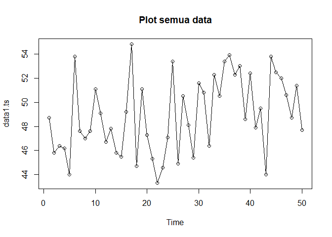<!-- -->

``` r
plot(train.ts, col="red",main="Plot data latih")
points(train.ts)
```

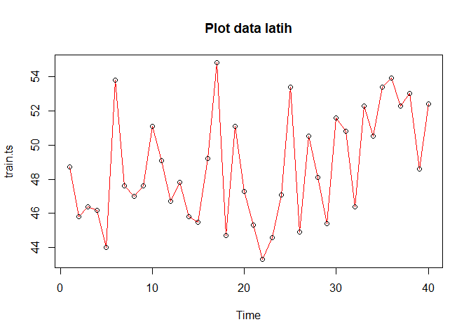<!-- -->

``` r
plot(test.ts, col="blue",main="Plot data uji")
points(test.ts)
```

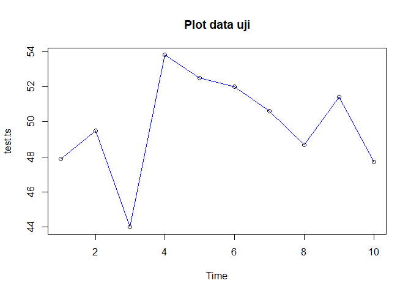<!-- -->

``` r
#Eksplorasi dengan GGPLOT
library(ggplot2)
ggplot() + 
  geom_line(data = training, aes(x = Periode, y = Yt, col = "Data Latih")) +
  geom_line(data = testing, aes(x = Periode, y = Yt, col = "Data Uji")) +
  labs(x = "Periode Waktu", y = "Membaca", color = "Legend") +
  scale_colour_manual(name="Keterangan:", breaks = c("Data Latih", "Data Uji"),
                      values = c("blue", "red")) + 
  theme_bw() + theme(legend.position = "bottom",
                     plot.caption = element_text(hjust=0.5, size=12))
```

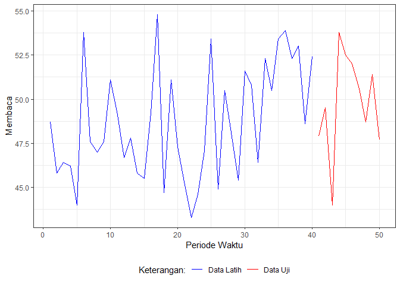<!-- -->

### Single Exponential Smoothing

Single Exponential Smoothing (SES) adalah metode peramalan deret waktu
yang dikembangkan untuk mengatasi kelemahan Moving Average. Jika pada
Moving Average setiap data periode sebelumnya dianggap memiliki bobot
yang sama, maka SES memberikan bobot yang semakin mengecil secara
eksponensial terhadap data lama, sehingga data terbaru diberi bobot
lebih besar.

Single Exponential Smoothing merupakan metode pemulusan yang tepat
digunakan untuk data dengan pola stasioner atau konstan.

Nilai pemulusan pada periode ke-t didapat dari persamaan:

\tilde{y}_{T-1}")

Nilai parameter

adalah nilai antara 0 dan 1.

Nilai pemulusan periode ke-t bertindak sebagai nilai ramalan pada
periode
ke-").

=\tilde{y}_T")

Pemulusan dengan metode SES dapat dilakukan dengan dua fungsi dari
*packages* berbeda, yaitu (1) fungsi `ses()` dari *packages* `forecast`
dan (2) fungsi `HoltWinters` dari *packages* `stats` .

``` r
#Cara 1 (fungsi ses)
ses.1 <- ses(train.ts, h = 10, alpha = 0.2)
plot(ses.1)
```

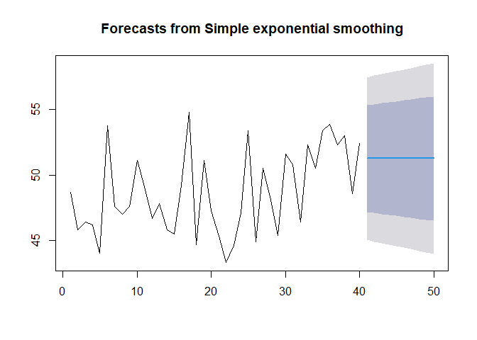<!-- -->

``` r
ses.1
```

    ##    Point Forecast    Lo 80    Hi 80    Lo 95    Hi 95
    ## 41        51.2589 47.18575 55.33206 45.02955 57.48826
    ## 42        51.2589 47.10508 55.41272 44.90618 57.61162
    ## 43        51.2589 47.02596 55.49185 44.78517 57.73264
    ## 44        51.2589 46.94828 55.56953 44.66637 57.85143
    ## 45        51.2589 46.87198 55.64583 44.54968 57.96812
    ## 46        51.2589 46.79698 55.72082 44.43499 58.08282
    ## 47        51.2589 46.72323 55.79458 44.32219 58.19562
    ## 48        51.2589 46.65065 55.86715 44.21119 58.30661
    ## 49        51.2589 46.57920 55.93860 44.10192 58.41589
    ## 50        51.2589 46.50883 56.00898 43.99429 58.52352

``` r
ses.2<- ses(train.ts, h = 10, alpha = 0.7)
plot(ses.2)
```

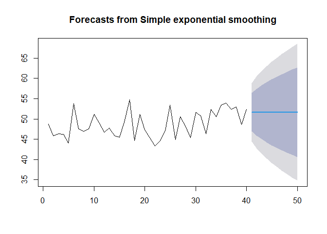<!-- -->

``` r
ses.2
```

    ##    Point Forecast    Lo 80    Hi 80    Lo 95    Hi 95
    ## 41       51.64682 46.89683 56.39681 44.38234 58.91130
    ## 42       51.64682 45.84872 57.44492 42.77939 60.51425
    ## 43       51.64682 44.96299 58.33065 41.42479 61.86885
    ## 44       51.64682 44.18162 59.11201 40.22979 63.06385
    ## 45       51.64682 43.47463 59.81901 39.14853 64.14511
    ## 46       51.64682 42.82411 60.46953 38.15364 65.14000
    ## 47       51.64682 42.21836 61.07528 37.22723 66.06640
    ## 48       51.64682 41.64925 61.64439 36.35685 66.93679
    ## 49       51.64682 41.11083 62.18281 35.53342 67.76022
    ## 50       51.64682 40.59863 62.69501 34.75006 68.54357

Pada fungsi `ses()` , terdapat beberapa argumen yang umum digunakan,
yaitu

- `y` : nilai data deret waktu

- `alpha` : parameter pemulusan utama (0–1), mengatur bobot data terbaru
  vs data lama.

- `beta` : parameter pemulusan tren.

- `gamma` : parameter pemulusan musiman.

- `h` : jumlah periode ke depan yang ingin diramalkan (forecast
  horizon).

  Kasus di atas merupakan contoh inisialisasi nilai parameter
  
  dengan nilai `alpha` 0,2 dan 0,7 dan banyak periode data yang akan
  diramalkan adalah sebanyak 10 periode.

Untuk mendapatkan gambar hasil pemulusan pada data latih dengan fungsi
`ses()` , perlu digunakan fungsi `autoplot()` dan `autolayer()` dari
*library packages* `ggplot2` .

``` r
autoplot(ses.1) +
  autolayer(fitted(ses.1), series="Fitted") +
  ylab("Membaca") + xlab("Periode")
```

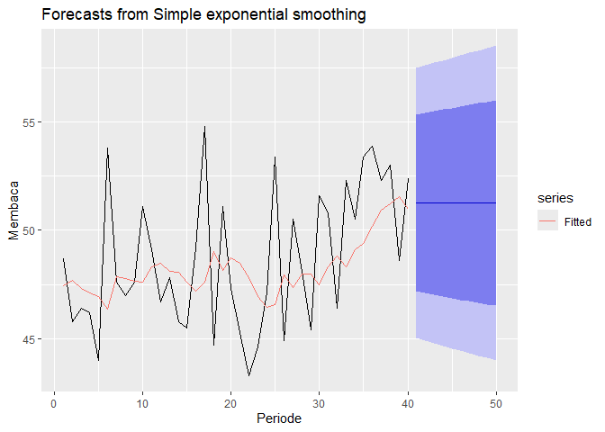<!-- -->

Selanjutnya akan digunakan fungsi `HoltWinters()` dengan nilai
inisialisasi parameter dan panjang periode peramalan yang sama dengan
fungsi `ses()` .

``` r
#Cara 2 (fungsi Holtwinter)
ses1<- HoltWinters(train.ts, gamma = FALSE, beta = FALSE, alpha = 0.2)
plot(ses1)
```

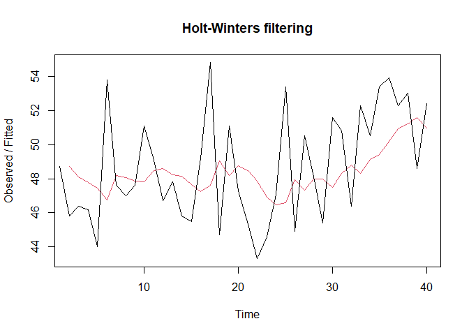<!-- -->

``` r
#ramalan
ramalan1<- forecast(ses1, h=10)
ramalan1
```

    ##    Point Forecast    Lo 80    Hi 80    Lo 95    Hi 95
    ## 41       51.25907 47.18474 55.33340 45.02791 57.49023
    ## 42       51.25907 47.10405 55.41409 44.90451 57.61363
    ## 43       51.25907 47.02490 55.49324 44.78346 57.73468
    ## 44       51.25907 46.94720 55.57094 44.66463 57.85351
    ## 45       51.25907 46.87088 55.64726 44.54791 57.97023
    ## 46       51.25907 46.79586 55.72228 44.43318 58.08496
    ## 47       51.25907 46.72208 55.79606 44.32035 58.19779
    ## 48       51.25907 46.64949 55.86865 44.20932 58.30882
    ## 49       51.25907 46.57802 55.94012 44.10002 58.41812
    ## 50       51.25907 46.50762 56.01052 43.99236 58.52579

``` r
ses2<- HoltWinters(train.ts, gamma = FALSE, beta = FALSE, alpha = 0.7)
plot(ses2)
```

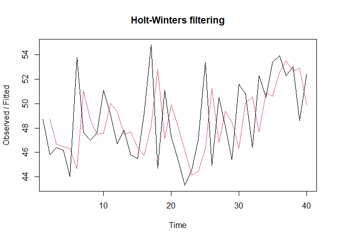<!-- -->

``` r
#ramalan
ramalan2<- forecast(ses2, h=10)
ramalan2
```

    ##    Point Forecast    Lo 80    Hi 80    Lo 95    Hi 95
    ## 41       51.64682 46.89554 56.39810 44.38036 58.91328
    ## 42       51.64682 45.84714 57.44650 42.77697 60.51667
    ## 43       51.64682 44.96117 58.33247 41.42200 61.87164
    ## 44       51.64682 44.17959 59.11405 40.22668 63.06696
    ## 45       51.64682 43.47240 59.82124 39.14513 64.14851
    ## 46       51.64682 42.82170 60.47194 38.14997 65.14367
    ## 47       51.64682 42.21579 61.07785 37.22331 66.07033
    ## 48       51.64682 41.64652 61.64711 36.35269 66.94095
    ## 49       51.64682 41.10796 62.18568 35.52903 67.76461
    ## 50       51.64682 40.59562 62.69802 34.74546 68.54818

Fungsi `HoltWinters` memiliki argumen yang sama dengan fungsi `ses()` .
Argumen-argumen kedua fungsi dapat dilihat lebih lanjut dengan `?ses()`
atau `?HoltWinters` .

Nilai parameter
 dari
kedua fungsi dapat dioptimalkan menyesuaikan dari *error*-nya paling
minimumnya. Caranya adalah dengan membuat parameter

`NULL` .

``` r
#SES
ses.opt <- ses(train.ts, h = 10, alpha = NULL)
plot(ses.opt)
```

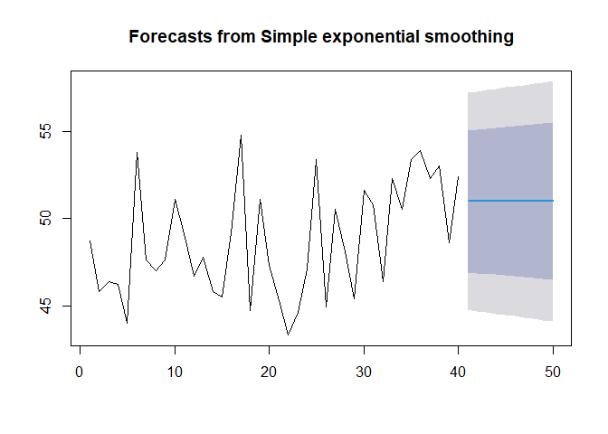<!-- -->

``` r
ses.opt
```

    ##    Point Forecast    Lo 80    Hi 80    Lo 95    Hi 95
    ## 41       50.98117 46.91751 55.04483 44.76633 57.19601
    ## 42       50.98117 46.86658 55.09576 44.68845 57.27389
    ## 43       50.98117 46.81628 55.14606 44.61153 57.35081
    ## 44       50.98117 46.76658 55.19575 44.53552 57.42682
    ## 45       50.98117 46.71746 55.24487 44.46039 57.50194
    ## 46       50.98117 46.66890 55.29344 44.38613 57.57621
    ## 47       50.98117 46.62088 55.34146 44.31269 57.64965
    ## 48       50.98117 46.57339 55.38895 44.24005 57.72229
    ## 49       50.98117 46.52640 55.43594 44.16818 57.79416
    ## 50       50.98117 46.47990 55.48244 44.09707 57.86527

``` r
#Lamda Optimum Holt Winter
HWopt<- HoltWinters(train.ts, gamma = FALSE, beta = FALSE,alpha = NULL)
HWopt
```

    ## Holt-Winters exponential smoothing without trend and without seasonal component.
    ## 
    ## Call:
    ## HoltWinters(x = train.ts, alpha = NULL, beta = FALSE, gamma = FALSE)
    ## 
    ## Smoothing parameters:
    ##  alpha: 0.161055
    ##  beta : FALSE
    ##  gamma: FALSE
    ## 
    ## Coefficients:
    ##     [,1]
    ## a 51.001

``` r
plot(HWopt)
```

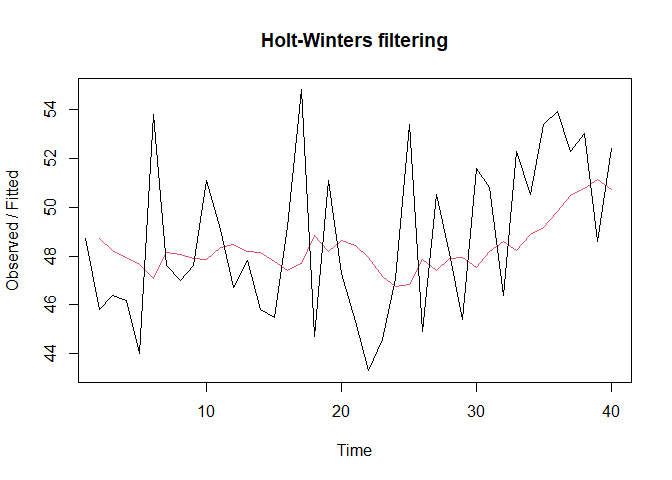<!-- -->

``` r
#ramalan
ramalanopt<- forecast(HWopt, h=10)
ramalanopt
```

    ##    Point Forecast    Lo 80    Hi 80    Lo 95    Hi 95
    ## 41         51.001 46.94040 55.06161 44.79084 57.21117
    ## 42         51.001 46.88807 55.11394 44.71082 57.29119
    ## 43         51.001 46.83640 55.16561 44.63179 57.37021
    ## 44         51.001 46.78537 55.21664 44.55374 57.44827
    ## 45         51.001 46.73494 55.26707 44.47662 57.52539
    ## 46         51.001 46.68511 55.31690 44.40041 57.60160
    ## 47         51.001 46.63584 55.36617 44.32506 57.67695
    ## 48         51.001 46.58712 55.41489 44.25055 57.75146
    ## 49         51.001 46.53894 55.46307 44.17686 57.82515
    ## 50         51.001 46.49126 55.51074 44.10395 57.89806

Setelah dilakukan peramalan, akan dilakukan perhitungan keakuratan hasil
peramalan. Perhitungan akurasi ini dilakukan baik pada data latih dan
data uji.

#### Akurasi Data Latih

Perhitungan akurasi data dapat dilakukan dengan cara langsung maupun
manual. Secara langsung, nilai akurasi dapat diambil dari objek yang
tersimpan pada hasil SES, yaitu *sum of squared errors* (SSE). Nilai
akurasi lain dapat dihitung pula dari nilai SSE tersebut.

``` r
#Keakuratan Metode
#Pada data training

# SES dengan alpha = 0.2
SSE1<-ses1$SSE
MSE1<-ses1$SSE/length(train.ts)
RMSE1<-sqrt(MSE1)

akurasi1 <- matrix(c(SSE1,MSE1,RMSE1))
row.names(akurasi1)<- c("SSE", "MSE", "RMSE")
colnames(akurasi1) <- c("Akurasi lamda=0.2")
akurasi1
```

    ##      Akurasi lamda=0.2
    ## SSE         388.280675
    ## MSE           9.707017
    ## RMSE          3.115609

``` r
# SES dengan alpha = 0.7
SSE2<-ses2$SSE
MSE2<-ses2$SSE/length(train.ts)
RMSE2<-sqrt(MSE2)

akurasi2 <- matrix(c(SSE2,MSE2,RMSE2))
row.names(akurasi2)<- c("SSE", "MSE", "RMSE")
colnames(akurasi2) <- c("Akurasi lamda=0.7")
akurasi2
```

    ##      Akurasi lamda=0.7
    ## SSE         522.770369
    ## MSE          13.069259
    ## RMSE          3.615143

``` r
#Cara Manual
# Alpha = 0.2
fitted1<-ramalan1$fitted
sisaan1<-ramalan1$residuals
head(sisaan1)
```

    ## Time Series:
    ## Start = 1 
    ## End = 6 
    ## Frequency = 1 
    ## [1]       NA -2.90000 -1.72000 -1.57600 -3.46080  7.03136

``` r
resid1<-training$Yt-ramalan1$fitted
head(resid1)
```

    ## Time Series:
    ## Start = 1 
    ## End = 6 
    ## Frequency = 1 
    ## [1]       NA -2.90000 -1.72000 -1.57600 -3.46080  7.03136

``` r
SSE.1=sum(sisaan1[2:length(train.ts)]^2)
SSE.1
```

    ## [1] 388.2807

``` r
MSE.1 = SSE.1/length(train.ts)
MSE.1
```

    ## [1] 9.707017

``` r
MAPE.1 = sum(abs(sisaan1[2:length(train.ts)]/train.ts[2:length(train.ts)])*
               100)/length(train.ts)
MAPE.1
```

    ## [1] 5.249856

``` r
akurasi.1 <- matrix(c(SSE.1,MSE.1,MAPE.1))
row.names(akurasi.1)<- c("SSE", "MSE", "MAPE")
colnames(akurasi.1) <- c("Akurasi lamda=0.2")
akurasi.1
```

    ##      Akurasi lamda=0.2
    ## SSE         388.280675
    ## MSE           9.707017
    ## MAPE          5.249856

``` r
# Alpha = 0.7
fitted2<-ramalan2$fitted
sisaan2<-ramalan2$residuals
head(sisaan2)
```

    ## Time Series:
    ## Start = 1 
    ## End = 6 
    ## Frequency = 1 
    ## [1]       NA -2.90000 -0.27000 -0.28100 -2.28430  9.11471

``` r
resid2<-training$Yt-ramalan2$fitted
head(resid2)
```

    ## Time Series:
    ## Start = 1 
    ## End = 6 
    ## Frequency = 1 
    ## [1]       NA -2.90000 -0.27000 -0.28100 -2.28430  9.11471

``` r
SSE.2=sum(sisaan2[2:length(train.ts)]^2)
SSE.2
```

    ## [1] 522.7704

``` r
MSE.2 = SSE.2/length(train.ts)
MSE.2
```

    ## [1] 13.06926

``` r
MAPE.2 = sum(abs(sisaan2[2:length(train.ts)]/train.ts[2:length(train.ts)])*
               100)/length(train.ts)
MAPE.2
```

    ## [1] 5.767118

``` r
akurasi.2 <- matrix(c(SSE.2,MSE.2,MAPE.2))
row.names(akurasi.2)<- c("SSE", "MSE", "MAPE")
colnames(akurasi.2) <- c("Akurasi lamda=0.7")
akurasi.2
```

    ##      Akurasi lamda=0.7
    ## SSE         522.770369
    ## MSE          13.069259
    ## MAPE          5.767118

Berdasarkan nilai SSE, MSE, RMSE, dan MAPE di antara kedua parameter,
nilai parameter

menghasilkan akurasi yang lebih baik dibanding

. Hal ini dilihat dari nilai masing-masing ukuran akurasi yang lebih
kecil. Berdasarkan nilai MAPE-nya, hasil ini dapat dikategorikan sebagai
peramalan sangat baik.

#### Akurasi Data Uji

Akurasi data uji dapat dihitung dengan cara yang hampir sama dengan
perhitungan akurasi data latih.

``` r
# jumlah observasi uji
n_test <- nrow(testing)

# error (ramalan - aktual), samakan panjang dan tipe numeric
e1   <- as.numeric(ramalan1$mean)[1:n_test] - as.numeric(testing$Yt)
e2   <- as.numeric(ramalan2$mean)[1:n_test] - as.numeric(testing$Yt)
eopt <- as.numeric(ramalanopt$mean)[1:n_test] - as.numeric(testing$Yt)

# SSE / MSE / RMSE untuk masing-masing model (abaikan NA)
SSEtesting1  <- sum(e1^2,  na.rm = TRUE)
MSEtesting1  <- mean(e1^2, na.rm = TRUE)
RMSEtesting1 <- sqrt(MSEtesting1)

SSEtesting2  <- sum(e2^2,  na.rm = TRUE)
MSEtesting2  <- mean(e2^2, na.rm = TRUE)
RMSEtesting2 <- sqrt(MSEtesting2)

SSEtestingopt  <- sum(eopt^2,  na.rm = TRUE)
MSEtestingopt  <- mean(eopt^2, na.rm = TRUE)
RMSEtestingopt <- sqrt(MSEtestingopt)

# Tabel ringkas
akurasitesting_SSE <- matrix(c(SSEtesting1, SSEtesting2, SSEtestingopt),
                             nrow = 3,
                             dimnames = list(c("SSE1","SSE2","SSEopt"), "Nilai"))
akurasitesting_MSE <- matrix(c(MSEtesting1, MSEtesting2, MSEtestingopt),
                             nrow = 3,
                             dimnames = list(c("MSE1","MSE2","MSEopt"), "Nilai"))
akurasitesting_RMSE <- matrix(c(RMSEtesting1, RMSEtesting2, RMSEtestingopt),
                              nrow = 3,
                              dimnames = list(c("RMSE1","RMSE2","RMSEopt"), "Nilai"))

akurasitesting_SSE
```

    ##            Nilai
    ## SSE1    95.28706
    ## SSE2   108.02806
    ## SSEopt  88.47392

``` r
akurasitesting_MSE
```

    ##            Nilai
    ## MSE1    9.528706
    ## MSE2   10.802806
    ## MSEopt  8.847392

``` r
akurasitesting_RMSE
```

    ##            Nilai
    ## RMSE1   3.086860
    ## RMSE2   3.286762
    ## RMSEopt 2.974457

Selain dengan cara di atas, perhitungan nilai akurasi dapat menggunakan
fungsi `accuracy()` dari *package* `forecast` . Penggunaannya yaitu
dengan menuliskan `accuracy(hasil ramalan, kondisi aktual)` . Contohnya
adalah sebagai berikut.

``` r
accuracy(ramalan1, testing$Yt)
```

    ##                     ME     RMSE      MAE       MPE     MAPE      MASE
    ## Training set  0.328086 3.155299 2.647471  0.285487 5.384468 0.7924126
    ## Test set     -1.449071 3.086860 2.381814 -3.229724 4.986852 0.7128991
    ##                    ACF1
    ## Training set -0.1059246
    ## Test set             NA

``` r
accuracy(ramalan2, testing$Yt)
```

    ##                      ME     RMSE      MAE        MPE     MAPE      MASE
    ## Training set  0.1079421 3.661198 2.898138 -0.1459534 5.914992 0.8674395
    ## Test set     -1.8368194 3.286762 2.508728 -4.0106046 5.271903 0.7508855
    ##                    ACF1
    ## Training set -0.3955538
    ## Test set             NA

``` r
accuracy(ramalanopt, testing$Yt)
```

    ##                      ME     RMSE      MAE       MPE     MAPE      MASE
    ## Training set  0.3663352 3.149004 2.666641  0.357541 5.419489 0.7981504
    ## Test set     -1.1910047 2.974457 2.330201 -2.710010 4.861054 0.6974508
    ##                     ACF1
    ## Training set -0.07140176
    ## Test set              NA

### *Double Exponential Smoothing* (DES)

Metode pemulusan *Double Exponential Smoothing* (DES) digunakan untuk
data yang memiliki pola tren. Metode DES adalah metode semacam SES,
hanya saja dilakukan dua kali, yaitu pertama untuk tahapan ‘level’ dan
kedua untuk tahapan ‘tren’. Pemulusan menggunakan metode ini akan
menghasilkan peramalan tidak konstan untuk periode berikutnya.

Pemulusan dengan metode DES kali ini akan menggunakan fungsi
`HoltWinters()` . Jika sebelumnya nilai argumen `beta` dibuat `FALSE` ,
kali ini argumen tersebut akan diinisialisasi bersamaan dengan nilai
`alpha` .

``` r
#Lamda=0.2 dan gamma=0.2
des.1<- HoltWinters(train.ts, gamma = FALSE, beta = 0.2, alpha = 0.2)
plot(des.1)
```

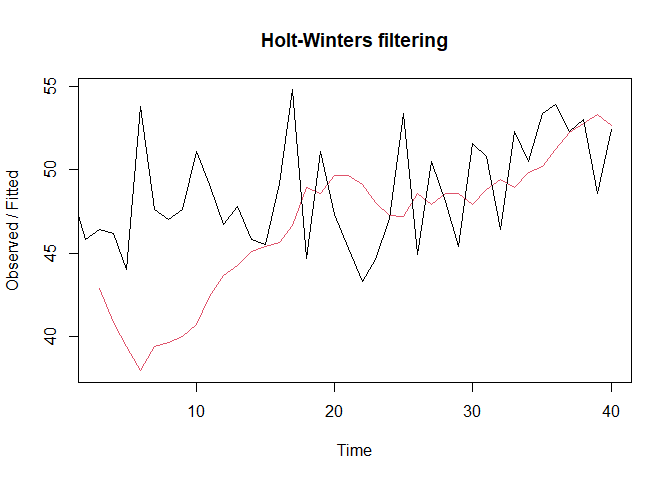<!-- -->

``` r
#ramalan
ramalandes1<- forecast(des.1, h=10)
ramalandes1
```

    ##    Point Forecast    Lo 80    Hi 80    Lo 95    Hi 95
    ## 41       52.93449 46.89794 58.97104 43.70238 62.16660
    ## 42       53.23737 47.02939 59.44534 43.74309 62.73164
    ## 43       53.54024 47.10629 59.97420 43.70036 63.38013
    ## 44       53.84312 47.12544 60.56081 43.56931 64.11693
    ## 45       54.14600 47.08556 61.20645 43.34798 64.94402
    ## 46       54.44888 46.98696 61.91080 43.03685 65.86090
    ## 47       54.75176 46.83121 62.67230 42.63833 66.86519
    ## 48       55.05464 46.62073 63.48854 42.15608 67.95319
    ## 49       55.35751 46.35839 64.35663 41.59454 69.12048
    ## 50       55.66039 46.04729 65.27350 40.95842 70.36236

``` r
#Lamda=0.6 dan gamma=0.3
des.2<- HoltWinters(train.ts, gamma = FALSE, beta = 0.3, alpha = 0.6)
plot(des.2)
```

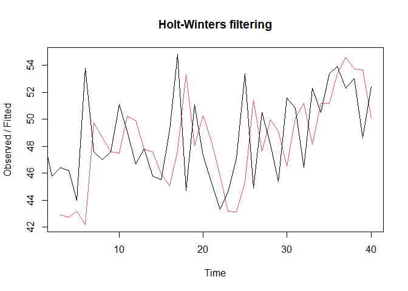<!-- -->

``` r
#ramalan
ramalandes2<- forecast(des.2, h=10)
ramalandes2
```

    ##    Point Forecast    Lo 80    Hi 80    Lo 95    Hi 95
    ## 41       51.35923 46.08547 56.63298 43.29371 59.42474
    ## 42       51.24032 44.55201 57.92864 41.01142 61.46922
    ## 43       51.12142 42.73300 59.50984 38.29244 63.95040
    ## 44       51.00252 40.68212 61.32292 35.21883 66.78621
    ## 45       50.88362 38.43488 63.33236 31.84491 69.92232
    ## 46       50.76472 36.01516 65.51427 28.20722 73.32221
    ## 47       50.64581 33.43979 67.85184 24.33147 76.96015
    ## 48       50.52691 30.72117 70.33265 20.23665 80.81717
    ## 49       50.40801 27.86889 72.94712 15.93741 84.87861
    ## 50       50.28911 24.89063 75.68759 11.44548 89.13273

Selanjutnya jika ingin membandingkan plot data latih dan data uji adalah
sebagai berikut.

``` r
plot(data1.ts)
lines(des.1$fitted[,1], lty=2, col="blue")
lines(ramalandes1$mean, col="red")
```

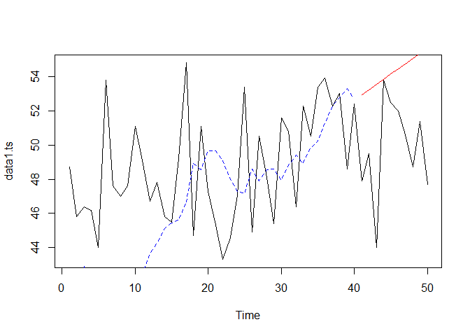<!-- -->

Untuk mendapatkan nilai parameter optimum dari DES, argumen `alpha` dan
`beta` dapat dibuat `NULL` seperti berikut.

``` r
#Lamda dan gamma optimum
des.opt<- HoltWinters(train.ts, gamma = FALSE)
des.opt
```

    ## Holt-Winters exponential smoothing with trend and without seasonal component.
    ## 
    ## Call:
    ## HoltWinters(x = train.ts, gamma = FALSE)
    ## 
    ## Smoothing parameters:
    ##  alpha: 0.4635085
    ##  beta : 0.2628024
    ##  gamma: FALSE
    ## 
    ## Coefficients:
    ##          [,1]
    ## a 51.81211440
    ## b -0.03605837

``` r
plot(des.opt)
```

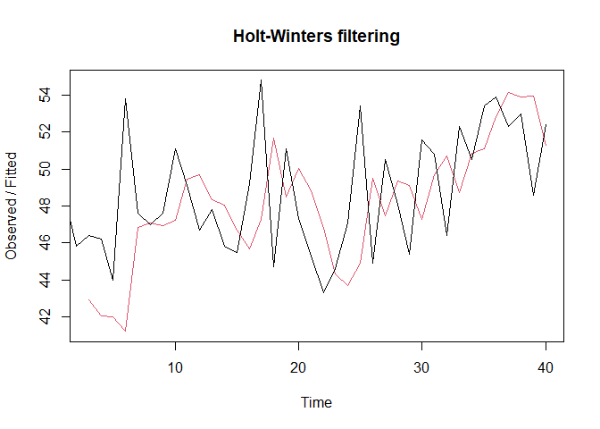<!-- -->

``` r
#ramalan
ramalandesopt<- forecast(des.opt, h=10)
ramalandesopt
```

    ##    Point Forecast    Lo 80    Hi 80    Lo 95    Hi 95
    ## 41       51.77606 46.66859 56.88352 43.96486 59.58725
    ## 42       51.74000 45.82194 57.65805 42.68912 60.79088
    ## 43       51.70394 44.77088 58.63700 41.10074 62.30714
    ## 44       51.66788 43.54431 59.79145 39.24395 64.09181
    ## 45       51.63182 42.16755 61.09610 37.15746 66.10618
    ## 46       51.59576 40.66041 62.53112 34.87158 68.31995
    ## 47       51.55971 39.03793 64.08148 32.40931 70.71011
    ## 48       51.52365 37.31150 65.73580 29.78804 73.25926
    ## 49       51.48759 35.48986 67.48532 27.02118 75.95400
    ## 50       51.45153 33.57990 69.32316 24.11923 78.78383

Selanjutnya akan dilakukan perhitungan akurasi pada data latih maupun
data uji dengan ukuran akurasi SSE, MSE dan MAPE.

#### Akurasi Data Latih

``` r
#Akurasi Data Training
ssedes.train1<-des.1$SSE
msedes.train1<-ssedes.train1/length(train.ts)
sisaandes1<-ramalandes1$residuals
head(sisaandes1)
```

    ## Time Series:
    ## Start = 1 
    ## End = 6 
    ## Frequency = 1 
    ## [1]       NA       NA  3.50000  5.36000  4.63360 15.86714

``` r
mapedes.train1 <- sum(abs(sisaandes1[3:length(train.ts)]/train.ts[3:length(train.ts)])
                      *100)/length(train.ts)

akurasides.1 <- matrix(c(ssedes.train1,msedes.train1,mapedes.train1))
row.names(akurasides.1)<- c("SSE", "MSE", "MAPE")
colnames(akurasides.1) <- c("Akurasi lamda=0.2 dan gamma=0.2")
akurasides.1
```

    ##      Akurasi lamda=0.2 dan gamma=0.2
    ## SSE                        989.65686
    ## MSE                         24.74142
    ## MAPE                         7.75642

``` r
ssedes.train2<-des.2$SSE
msedes.train2<-ssedes.train2/length(train.ts)
sisaandes2<-ramalandes2$residuals
head(sisaandes2)
```

    ## Time Series:
    ## Start = 1 
    ## End = 6 
    ## Frequency = 1 
    ## [1]       NA       NA  3.50000  3.47000  0.83340 11.62875

``` r
mapedes.train2 <- sum(abs(sisaandes2[3:length(train.ts)]/train.ts[3:length(train.ts)])
                      *100)/length(train.ts)

akurasides.2 <- matrix(c(ssedes.train2,msedes.train2,mapedes.train2))
row.names(akurasides.2)<- c("SSE", "MSE", "MAPE")
colnames(akurasides.2) <- c("Akurasi lamda=0.6 dan gamma=0.3")
akurasides.2
```

    ##      Akurasi lamda=0.6 dan gamma=0.3
    ## SSE                       632.851720
    ## MSE                        15.821293
    ## MAPE                        6.232456

Hasil akurasi dari data latih didapatkan skenario 2 dengan lamda=0.6 dan
gamma=0.3 memiliki hasil yang lebih baik. Namun untuk kedua skenario
dapat dikategorikan peramalan sangat baik berdasarkan nilai MAPE-nya.

#### Akurasi Data Uji

``` r
#Akurasi Data Testing
selisihdes1<-ramalandes1$mean-testing$Yt
selisihdes1
```

    ## Time Series:
    ## Start = 41 
    ## End = 50 
    ## Frequency = 1 
    ##  [1] 5.03448806 3.73736622 9.54024438 0.04312254 1.64600071 2.44887887
    ##  [7] 4.15175703 6.35463519 3.95751335 7.96039151

``` r
SSEtestingdes1<-sum(selisihdes1^2)
MSEtestingdes1<-SSEtestingdes1/length(testing$Yt)
MAPEtestingdes1<-sum(abs(selisihdes1/testing$Yt)*100)/length(testing$Yt)

selisihdes2<-ramalandes2$mean-testing$Yt
selisihdes2
```

    ## Time Series:
    ## Start = 41 
    ## End = 50 
    ## Frequency = 1 
    ##  [1]  3.45922576  1.74032361  7.12142147 -2.79748068 -1.61638283 -1.23528497
    ##  [7]  0.04581288  1.82691074 -0.99199141  2.58910645

``` r
SSEtestingdes2<-sum(selisihdes2^2)
MSEtestingdes2<-SSEtestingdes2/length(testing$Yt)
MAPEtestingdes2<-sum(abs(selisihdes2/testing$Yt)*100)/length(testing$Yt)

selisihdesopt<-ramalandesopt$mean-testing$Yt
selisihdesopt
```

    ## Time Series:
    ## Start = 41 
    ## End = 50 
    ## Frequency = 1 
    ##  [1]  3.87605603  2.23999765  7.70393928 -2.13211910 -0.86817747 -0.40423584
    ##  [7]  0.95970578  2.82364741  0.08758903  3.75153066

``` r
SSEtestingdesopt<-sum(selisihdesopt^2)
MSEtestingdesopt<-SSEtestingdesopt/length(testing$Yt)
MAPEtestingdesopt<-sum(abs(selisihdesopt/testing$Yt)*100)/length(testing$Yt)

akurasitestingdes <-
  matrix(c(SSEtestingdes1,MSEtestingdes1,MAPEtestingdes1,SSEtestingdes2,MSEtestingdes2,
           MAPEtestingdes2,SSEtestingdesopt,MSEtestingdesopt,MAPEtestingdesopt),
         nrow=3,ncol=3)
row.names(akurasitestingdes)<- c("SSE", "MSE", "MAPE")
colnames(akurasitestingdes) <- c("des ske1","des ske2","des opt")
akurasitestingdes
```

    ##        des ske1  des ske2    des opt
    ## SSE  275.686644 88.701354 107.830825
    ## MSE   27.568664  8.870135  10.783082
    ## MAPE   9.330928  4.877651   5.225022

#### Perbandingan SES dan DES

``` r
MSEfull <-
  matrix(c(MSEtesting1,MSEtesting2,MSEtestingopt,MSEtestingdes1,MSEtestingdes2,
           MSEtestingdesopt),nrow=3,ncol=2)
row.names(MSEfull)<- c("ske 1", "ske 2", "ske opt")
colnames(MSEfull) <- c("ses","des")
MSEfull
```

    ##               ses       des
    ## ske 1    9.528706 27.568664
    ## ske 2   10.802806  8.870135
    ## ske opt  8.847392 10.783082

Kedua metode dapat dibandingkan dengan menggunakan ukuran akurasi yang
sama. Contoh di atas adalah perbandingan kedua metode dengan ukuran
akurasi MSE. Hasilnya didapatkan metode DES lebih baik dibandingkan
metode SES dilihat dari MSE yang lebih kecil nilainya.

## Seasonal Smoothing

Pertama impor kembali data baru untuk latihan data musiman.

``` r
#Import data
library(rio)
data3 <- import("https://raw.githubusercontent.com/rizkynurhambali/praktikum-sta1341/main/Pertemuan%201/Electric_Production.csv")
data3.ts <- ts(data3$Yt)
```

Selanjutnya melakukan pembagian data dan mengubahnya menjadi data deret
waktu.

``` r
#membagi data menjadi training dan testing
training<-data3[1:192,2]
testing<-data3[193:241,2]
training.ts<-ts(training, frequency = 13)
testing.ts<-ts(testing, frequency = 13)
```

Kemudian akan dilakukan eskplorasi dengan plot data deret waktu sebagai
berikut.

``` r
#Membuat plot time series
plot(data3.ts, col="red",main="Plot semua data")
points(data3.ts)
```

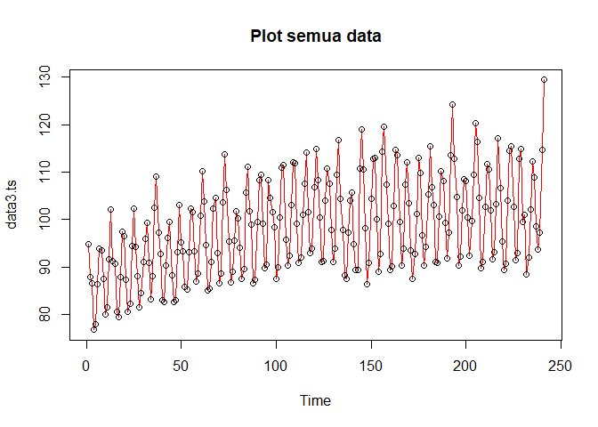<!-- -->

``` r
plot(training.ts, col="blue",main="Plot data latih")
points(training.ts)
```

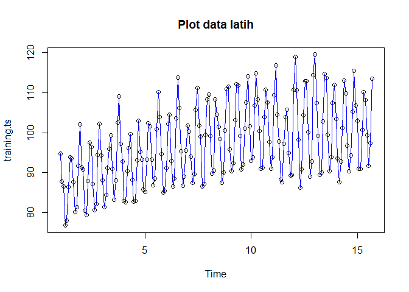<!-- -->

``` r
plot(testing.ts, col="green",main="Plot data uji")
points(testing.ts)
```

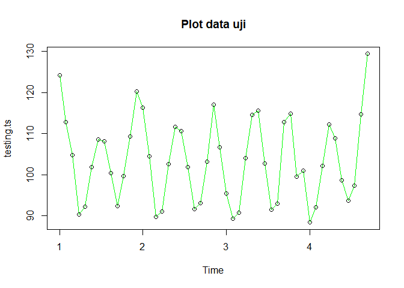<!-- -->

Metode Holt-Winter untuk peramalan data musiman menggunakan tiga
persamaan pemulusan yang terdiri atas persamaan untuk level
"), trend
"), dan
komponen seasonal / musiman
") dengan
parameter pemulusan berupa
,
, dan
.
Metode Holt-Winter musiman terbagi menjadi dua, yaitu metode aditif dan
metode multiplikatif. Perbedaan persamaan dan contoh datanya adalah
sebagai berikut.

 + (1-\alpha)(L_{t-1} + B_{t-1})")

 + (1-\beta)B_{t-1}")

 + (1-\gamma)S_{t-s}")


Pemulusan data musiman dengan metode Winter dilakukan menggunakan fungsi
`HoltWinters()` dengan memasukkan argumen tambahan, yaitu `gamma()` dan
`seasonal()` . Arguman `seasonal()` diinisialisasi menyesuaikan jenis
musiman, aditif atau multiplikatif.

### Winter Aditif

Perhitungan dengan model aditif dilakukan jika plot data asli
menunjukkan fluktuasi musiman yang relatif stabil (konstan).

#### Pemulusan

``` r
#Pemulusan dengan winter aditif 
winter1 <- HoltWinters(training.ts,alpha=0.2,beta=0.1,gamma=0.1,seasonal = "additive")
winter1$fitted
```

    ## Time Series:
    ## Start = c(2, 1) 
    ## End = c(15, 10) 
    ## Frequency = 13 
    ##                xhat     level        trend        season
    ##  2.000000  88.54720  87.09424  0.182710904  1.2702538462
    ##  2.076923  89.35006  87.80409  0.235424883  1.3105461538
    ##  2.153846  80.20116  88.31712  0.263185721 -8.3791461538
    ##  2.230769  79.24275  88.64359  0.269514524 -9.6703615385
    ##  2.307692  86.99289  88.94230  0.272433583 -2.2218384615
    ##  2.384615  96.28834  89.38477  0.289437697  6.6141307692
    ##  2.461538  96.00536  89.91460  0.313476850  5.7772846154
    ##  2.538462  96.01483  90.31015  0.321683558  5.3830000000
    ##  2.615385  88.18864  88.87382  0.145882946 -0.8310692308
    ##  2.692308  79.68943  87.51016 -0.005071818 -7.8156615385
    ##  2.769231  81.37692  88.00770  0.045189654 -6.6759769231
    ##  2.846154  93.80604  90.67977  0.307877345  2.8183923077
    ##  2.923077 105.56926  92.67246  0.476358567 12.4204461538
    ##  3.000000  92.62681  90.89474  0.250951296  1.4811097582
    ##  3.076923  91.82073  90.23887  0.160269181  1.4215895083
    ##  3.153846  79.92237  88.32350 -0.047295489 -8.3538309434
    ##  3.230769  79.56744  89.18277  0.043361094 -9.6586853012
    ##  3.307692  89.63976  91.52076  0.272824225 -2.1538220045
    ##  3.384615 100.17500  93.06477  0.399942979  6.7102873806
    ##  3.461538  99.49776  93.30379  0.383850936  5.8101114488
    ##  3.538462  96.86370  91.97165  0.212251801  4.6797975513
    ##  3.615385  87.94223  89.43933 -0.062206265 -1.4348882870
    ##  3.692308  81.72203  89.39687 -0.060230876 -7.6146156534
    ##  3.769231  88.21262  93.48340  0.354444600 -5.6252261566
    ##  3.846154 102.28161  98.01694  0.772354299  3.4923171948
    ##  3.923077 109.95628  97.76731  0.670156106 11.5188170705
    ##  4.000000  96.45785  95.01187  0.327596431  1.1183812995
    ##  4.076923  93.27897  92.63090  0.056739478  0.5913308268
    ##  4.153846  82.39203  90.54114 -0.157909864 -7.9912046133
    ##  4.230769  83.24525  91.98393  0.002159568 -8.7408327760
    ##  4.307692  93.16522  94.55184  0.258734485 -1.6453469861
    ##  4.384615 103.12062  96.08821  0.386498014  6.6459192062
    ##  4.461538  98.72020  93.50678  0.089705553  5.1237149089
    ##  4.538462  93.74063  90.38964 -0.230978441  3.5819652871
    ##  4.615385  86.12278  87.99692 -0.447153075 -1.4269867301
    ##  4.692308  82.66807  88.93283 -0.308846681 -5.9559137485
    ##  4.769231  88.83358  92.68947  0.097701909 -3.9535873604
    ##  4.846154  97.37066  94.06196  0.225180215  3.0835244197
    ##  4.923077 103.75558  93.46412  0.142879019 10.1485783719
    ##  5.000000  89.83351  90.01489 -0.216332596  0.0349534879
    ##  5.076923  88.30330  88.87887 -0.308300739 -0.2672665429
    ##  5.153846  81.98633  89.54783 -0.210574838 -7.3509268847
    ##  5.230769  85.90162  93.41859  0.197558586 -7.7145331056
    ##  5.307692  96.13950  96.76169  0.512112279 -1.1342928718
    ##  5.384615 102.62193  96.70768  0.455500182  5.4587493611
    ##  5.461538  98.00088  94.01883  0.141065657  3.8409789325
    ##  5.538462  94.94451  92.27470 -0.047453868  2.7172667510
    ##  5.615385  92.59431  93.39841  0.069661833 -0.8737611515
    ##  5.692308  93.07702  96.98535  0.421389715 -4.3297193897
    ##  5.769231  96.75259  99.55959  0.636675391 -3.4436741371
    ##  5.846154 103.10340  99.75639  0.592687520  2.7543196387
    ##  5.923077 105.68439  96.74080  0.231859596  8.7117319094
    ##  6.000000  92.42340  92.92884 -0.172522180 -0.3329190837
    ##  6.076923  92.41103  92.48686 -0.199468137  0.1236370614
    ##  6.153846  88.52750  94.24918 -0.003288663 -5.7183931869
    ##  6.230769  91.29324  97.43403  0.315525294 -6.4563183365
    ##  6.307692  97.06080  98.07361  0.347930457 -1.3607412575
    ##  6.384615 100.64814  96.31032  0.136808437  4.2010112593
    ##  6.461538  97.01442  94.03220 -0.104684399  3.0869008327
    ##  6.538462  98.44481  95.23319  0.025883230  3.1857295552
    ##  6.615385  99.17923  98.31464  0.331439093  0.5331503774
    ##  6.692308  97.04449 100.04203  0.471034586 -3.4685766847
    ##  6.769231  97.00332 100.18475  0.438202829 -3.6196256246
    ##  6.846154 100.11056  98.56694  0.232602346  1.3110079451
    ##  6.923077 103.68868  96.58348  0.010995242  7.0942048051
    ##  7.000000  94.36425  94.95764 -0.152688284 -0.4407029133
    ##  7.076923  97.19534  96.29106 -0.004077185  0.9083549571
    ##  7.153846  92.50134  96.88841  0.056066081 -4.4431373574
    ##  7.230769  91.00883  97.24901  0.086519218 -6.3266976845
    ##  7.307692  94.45064  96.63900  0.016866551 -2.2052293388
    ##  7.384615  98.84380  95.68862 -0.079858282  3.2350399181
    ##  7.461538 100.65223  96.98526  0.057791633  3.6091713458
    ##  7.538462 103.82082  99.14489  0.267975103  4.4079530094
    ##  7.615385 100.32328  99.00460  0.227148744  1.0915323476
    ##  7.692308  95.55830  98.95839  0.199813096 -3.5999037105
    ##  7.769231  92.91824  97.34207  0.018199036 -4.4420275564
    ##  7.846154  96.55018  96.22130 -0.095697716  0.4245795264
    ##  7.923077 103.12001  96.71708 -0.036549304  6.4394707021
    ##  8.000000  97.94835  97.72655  0.068052587  0.1537414845
    ##  8.076923 101.54991 100.10218  0.298809633  1.1489280204
    ##  8.153846  95.84290  99.91410  0.250121347 -4.3213248080
    ##  8.230769  92.47007  98.94698  0.128397347 -6.6053083563
    ##  8.307692  96.16915  98.67311  0.088169871 -2.5921286679
    ##  8.384615 105.28753 101.17259  0.329300899  3.7856395767
    ##  8.461538 106.10177 101.33886  0.312998339  4.4499052278
    ##  8.538462 105.20143 100.73543  0.221355011  4.2446475737
    ##  8.615385 100.66439  99.59684  0.085360402  0.9821897524
    ##  8.692308  92.54708  97.05118 -0.177741338 -4.3263599496
    ##  8.769231  91.24261  96.36846 -0.228238908 -4.8976145629
    ##  8.846154  98.61515  97.99658 -0.042603094  0.6611731718
    ##  8.923077 107.48299 100.42101  0.204099864  6.8578782687
    ##  9.000000 102.79394 101.43235  0.284824131  1.0767696682
    ##  9.076923 101.40941 100.31103  0.144209235  0.9541748739
    ##  9.153846  93.36339  98.24811 -0.076502971 -4.8082208067
    ##  9.230769  91.10740  97.97025 -0.096638763 -6.7662182592
    ##  9.307692  98.78026 100.26533  0.142533328 -1.6276045550
    ##  9.384615 107.19184 103.06334  0.408080060  3.7204293355
    ##  9.461538 108.98540 104.40103  0.501041166  4.0833319157
    ##  9.538462 106.94934 102.94349  0.305183177  3.7006691355
    ##  9.615385  99.93468 100.02234 -0.017449623 -0.0702172047
    ##  9.692308  93.72638  98.42970 -0.174969143 -4.5283502321
    ##  9.769231  95.51776  99.70297 -0.030144716 -4.1550713072
    ##  9.846154 103.94185 102.08300  0.210872141  1.6479850052
    ##  9.923077 111.92110 104.32622  0.414107058  7.1807753385
    ## 10.000000 103.38305 102.66243  0.206317044  0.5143100816
    ## 10.076923 100.86361 100.79349 -0.001208003  0.0713260494
    ## 10.153846  94.37309  99.40208 -0.140228201 -4.8887639742
    ## 10.230769  96.03563 101.73780  0.107366006 -5.8095298959
    ## 10.307692 105.52255 105.60466  0.483315370 -0.5654176269
    ## 10.384615 111.26036 106.63052  0.537570308  4.0922737620
    ## 10.461538 108.62477 105.00374  0.321135025  3.2998999571
    ## 10.538462 104.17746 101.79880 -0.031472426  2.4101379369
    ## 10.615385  98.18817  99.17879 -0.290325698 -0.7002952864
    ## 10.692308  95.91847 100.04245 -0.174927137 -3.9490525238
    ## 10.769231  99.76741 102.83645  0.121965399 -3.1910038772
    ## 10.846154 107.25711 104.51823  0.277947147  2.4609246729
    ## 10.923077 109.32521 102.88842  0.087171032  6.3496152814
    ## 11.000000  98.71496  99.31013 -0.279375094 -0.3157901071
    ## 11.076923  97.18659  98.04890 -0.377560384 -0.4847547387
    ## 11.153846  96.08721 100.11844 -0.132850116 -3.8983871467
    ## 11.230769 100.11078 104.13447  0.282037749 -4.3057324407
    ## 11.307692 105.29822 105.27839  0.368226191 -0.3483978739
    ## 11.384615 107.60341 104.15756  0.219319730  3.2265326286
    ## 11.461538 102.21632 100.49565 -0.168802443  1.8894701528
    ## 11.538462  98.30324  97.39091 -0.462396883  1.3747248492
    ## 11.615385  95.99321  96.71560 -0.483687592 -0.2387010429
    ## 11.692308  94.72813  97.81499 -0.325379889 -2.7614823791
    ## 11.769231  97.02166  99.69371 -0.104970502 -2.5670768851
    ## 11.846154 100.71093  99.16086 -0.147757693  1.6978202108
    ## 11.923077 101.23787  96.73046 -0.376022233  4.8834307805
    ## 12.000000  92.65642  93.97857 -0.613609632 -0.7085312692
    ## 12.076923  97.21159  96.97055 -0.253050118  0.4940863328
    ## 12.153846  99.02272 101.07850  0.183050144 -2.2388356875
    ## 12.230769 100.01589 103.56361  0.413255791 -3.9609786697
    ## 12.307692 103.06139 103.62713  0.378282052 -0.9440237177
    ## 12.384615 102.37023 100.65313  0.043054321  1.6740439349
    ## 12.461538  98.91689  98.38942 -0.187622303  0.7150923914
    ## 12.538462 100.49986  99.28918 -0.078884125  1.2895620150
    ## 12.615385 102.23343 101.67164  0.167250707  0.3945297684
    ## 12.692308 102.47326 103.97249  0.380610203 -1.8798448320
    ## 12.769231 101.47797 103.88263  0.333563088 -2.7382256467
    ## 12.846154 102.57289 101.70562  0.082505751  0.7847620493
    ## 12.923077 103.64818  99.82855 -0.113451988  3.9330811843
    ## 13.000000 102.68460 101.85078  0.100116478  0.7337067884
    ## 13.076923 107.98625 105.31158  0.436184409  2.2384873802
    ## 13.153846 104.73152 105.62557  0.423965454 -1.3180130996
    ## 13.230769 101.13431 104.92379  0.311390991 -4.1008736240
    ## 13.307692 100.67092 102.87998  0.075870810 -2.2849346415
    ## 13.384615 101.45081 100.83563 -0.136151530  0.7513374379
    ## 13.461538 102.01468 100.97339 -0.108759813  1.1500451015
    ## 13.538462 105.82224 103.40306  0.145082604  2.2741013432
    ## 13.615385 106.65137 105.10285  0.300553760  1.2479677542
    ## 13.692308 102.05629 103.96737  0.156950282 -2.0680332916
    ## 13.769231  97.96489 101.78438 -0.077043485 -3.7424549963
    ## 13.846154 100.71704 100.87626 -0.160151196  0.0009310938
    ## 13.923077 106.79843 102.03894 -0.027868062  4.7873550482
    ## 14.000000 105.19774 103.04431  0.075455328  2.0779785129
    ## 14.076923 104.98227 102.75380  0.038858463  2.1896115597
    ## 14.153846  98.55409 100.51164 -0.189242858 -1.7683109539
    ## 14.230769  92.67075  98.12290 -0.409192608 -5.0429543447
    ## 14.307692  94.19119  97.73162 -0.407401688 -3.1330240016
    ## 14.384615  99.30646  98.71398 -0.268425525  0.8609043059
    ## 14.461538 103.36297 101.19140  0.006159350  2.1654147678
    ## 14.538462 105.52907 102.49699  0.136101853  2.8959859686
    ## 14.615385 101.50983 100.87589 -0.039617605  0.6735538408
    ## 14.692308  95.34420  98.61041 -0.262204177 -3.0040083612
    ## 14.769231  93.79057  98.14771 -0.282254107 -4.0748858368
    ## 14.846154 100.63922 100.16178 -0.052621419  0.5300636299
    ## 14.923077 108.52678 103.08151  0.244614170  5.2006486056
    ## 15.000000 105.10792 102.96757  0.208758658  1.9315910555
    ## 15.076923 104.19741 102.75371  0.166496227  1.2772062730
    ## 15.153846  97.53718 100.28256 -0.097267947 -2.6481099535
    ## 15.230769  93.60600  98.87054 -0.228743603 -5.0357906646
    ## 15.307692  97.39566 100.05973 -0.086949641 -2.5771193498
    ## 15.384615 104.65059 102.52325  0.168097095  1.9592438048
    ## 15.461538 106.32013 103.39635  0.238597278  2.6851847820
    ## 15.538462 104.51802 102.22710  0.097812660  2.1931081356
    ## 15.615385  99.40513  99.77873 -0.156805755 -0.2167924469
    ## 15.692308  95.91455  99.19796 -0.199202360 -3.0842080810

``` r
xhat1 <- winter1$fitted[,2]

winter1.opt<- HoltWinters(training.ts, alpha= NULL,  beta = NULL, gamma = NULL, seasonal = "additive")
winter1.opt
```

    ## Holt-Winters exponential smoothing with trend and additive seasonal component.
    ## 
    ## Call:
    ## HoltWinters(x = training.ts, alpha = NULL, beta = NULL, gamma = NULL,     seasonal = "additive")
    ## 
    ## Smoothing parameters:
    ##  alpha: 0.4047538
    ##  beta : 0
    ##  gamma: 1
    ## 
    ## Coefficients:
    ##            [,1]
    ## a   109.2446603
    ## b     0.1827109
    ## s1   -0.8266228
    ## s2    5.6964456
    ## s3    0.3679335
    ## s4   -1.1981680
    ## s5   -9.2800809
    ## s6   -8.1509015
    ## s7   -0.8688158
    ## s8    4.3878031
    ## s9    3.5559231
    ## s10  -1.7827396
    ## s11  -7.2290284
    ## s12  -4.4226157
    ## s13   4.2285397

``` r
winter1.opt$fitted
```

    ## Time Series:
    ## Start = c(2, 1) 
    ## End = c(15, 10) 
    ## Frequency = 13 
    ##                xhat     level     trend       season
    ##  2.000000  88.54720  87.09424 0.1827109   1.27025385
    ##  2.076923  89.83701  88.34376 0.1827109   1.31054615
    ##  2.153846  80.69475  88.89119 0.1827109  -8.37914615
    ##  2.230769  79.51454  89.00219 0.1827109  -9.67036154
    ##  2.307692  87.09484  89.13397 0.1827109  -2.22183846
    ##  2.384615  96.41638  89.61954 0.1827109   6.61413077
    ##  2.461538  96.19692  90.23692 0.1827109   5.77728462
    ##  2.538462  96.07390  90.50819 0.1827109   5.38300000
    ##  2.615385  86.46083  87.10919 0.1827109  -0.83106923
    ##  2.692308  77.30331  84.93626 0.1827109  -7.81566154
    ##  2.769231  80.60867  87.10194 0.1827109  -6.67597692
    ##  2.846154  95.91289  92.91179 0.1827109   2.81839231
    ##  2.923077 108.25457  95.65141 0.1827109  12.42044615
    ##  3.000000  93.20737  90.18551 0.1827109   2.83914360
    ##  3.076923  90.32767  88.29804 0.1827109   1.84691449
    ##  3.153846  76.58257  84.88445 0.1827109  -8.48459417
    ##  3.230769  78.69108  88.25364 0.1827109  -9.74526943
    ##  3.307692  91.84113  93.43486 0.1827109  -1.77644065
    ##  3.384615 102.73524  95.29915 0.1827109   7.25337618
    ##  3.461538 100.21016  94.11993 0.1827109   5.90751297
    ##  3.538462  90.83985  90.54153 0.1827109   0.11560808
    ##  3.615385  83.49537  87.60802 0.1827109  -4.29536258
    ##  3.692308  84.91386  89.63059 0.1827109  -4.89943847
    ##  3.769231  98.69569  96.91347 0.1827109   1.59950930
    ##  3.846154 108.07204 101.31064 0.1827109   6.57868522
    ##  3.923077 101.37750  97.08140 0.1827109   4.11338553
    ##  4.000000  93.78116  93.80379 0.1827109  -0.20534367
    ##  4.076923  86.32915  89.58838 0.1827109  -3.44194863
    ##  4.153846  84.62433  88.24005 0.1827109  -3.79843832
    ##  4.230769  88.54712  90.75867 0.1827109  -2.39426445
    ##  4.307692  94.86717  93.98792 0.1827109   0.69654855
    ##  4.384615 101.50057  96.06739 0.1827109   5.25046883
    ##  4.461538  91.45842  90.89943 0.1827109   0.37627394
    ##  4.538462  83.24697  87.53147 0.1827109  -4.46721922
    ##  4.615385  86.17978  87.58666 0.1827109  -1.58959214
    ##  4.692308  96.27035  90.54530 0.1827109   5.54233193
    ##  4.769231 101.43021  93.45005 0.1827109   7.79745781
    ##  4.846154  91.38710  91.11409 0.1827109   0.09030026
    ##  4.923077  91.26030  92.05308 0.1827109  -0.97549101
    ##  5.000000  83.53302  90.02369 0.1827109  -6.67338307
    ##  5.076923  85.38448  90.89533 0.1827109  -5.69355390
    ##  5.153846  94.05673  94.23719 0.1827109  -0.36316922
    ##  5.230769 100.06283  97.79404 0.1827109   2.08608484
    ##  5.307692 102.27950  98.61078 0.1827109   3.48600641
    ##  5.384615  92.72689  95.16261 0.1827109  -2.61843196
    ##  5.461538  88.32418  92.98695 0.1827109  -4.84547383
    ##  5.538462  88.79909  93.27114 0.1827109  -4.65476077
    ##  5.615385 100.98689  98.31138 0.1827109   2.49279706
    ##  5.692308 111.94349 102.21532 0.1827109   9.54545443
    ##  5.769231 103.39476  99.11864 0.1827109   4.09341078
    ##  5.846154  97.10793  95.72270 0.1827109   1.20251756
    ##  5.923077  86.98379  91.02977 0.1827109  -4.22869146
    ##  6.000000  85.12035  90.59787 0.1827109  -5.66022600
    ##  6.076923  92.32631  93.19119 0.1827109  -1.04758767
    ##  6.153846 102.16008  97.37841 0.1827109   4.59896421
    ##  6.230769 101.69657  98.49534 0.1827109   3.01851924
    ##  6.307692  93.45207  95.12307 0.1827109  -1.85370801
    ##  6.384615  86.58977  92.49380 0.1827109  -6.08674523
    ##  6.461538  88.96591  93.47944 0.1827109  -4.69623507
    ##  6.538462 102.23383  99.56220 0.1827109   2.48891673
    ##  6.615385 112.54312 104.39503 0.1827109   7.96537679
    ##  6.692308 106.89912 101.99375 0.1827109   4.72265749
    ##  6.769231  96.53654  97.52332 0.1827109  -1.16949671
    ##  6.846154  87.94903  93.73409 0.1827109  -5.96777363
    ##  6.923077  89.40455  94.35441 0.1827109  -5.13256869
    ##  7.000000  95.07372  97.00610 0.1827109  -2.11509058
    ##  7.076923 104.93349  99.90919 0.1827109   4.84159144
    ##  7.153846 104.33259  98.17701 0.1827109   5.97286168
    ##  7.230769  92.16043  94.18729 0.1827109  -2.20956889
    ##  7.307692  86.68788  92.49428 0.1827109  -5.98910466
    ##  7.384615  89.13828  93.86151 0.1827109  -4.90593768
    ##  7.461538 104.92159 100.75828 0.1827109   3.98060122
    ##  7.538462 112.97685 103.46658 0.1827109   9.32756555
    ##  7.615385 103.46508  99.11712 0.1827109   4.16525234
    ##  7.692308  95.53725  97.47496 0.1827109  -2.12042143
    ##  7.769231  87.16267  93.99075 0.1827109  -7.01078793
    ##  7.846154  89.05654  94.19804 0.1827109  -5.32420844
    ##  7.923077  97.29197  98.61085 0.1827109  -1.50159702
    ##  8.000000 105.33771 103.26939 0.1827109   1.88560833
    ##  8.076923 107.33941 105.13122 0.1827109   2.02548523
    ##  8.153846 102.00469 101.98527 0.1827109  -0.16328577
    ##  8.230769  92.42519  97.21056 0.1827109  -4.96807537
    ##  8.307692  92.53293  96.59732 0.1827109  -4.24710571
    ##  8.384615 108.28247 103.13174 0.1827109   4.96801882
    ##  8.461538 109.64985 101.77231 0.1827109   7.69482244
    ##  8.538462 101.50937  98.66428 0.1827109   2.66238312
    ##  8.615385  99.25339  97.58915 0.1827109   1.48153716
    ##  8.692308  85.68796  93.01839 0.1827109  -7.51314505
    ##  8.769231  88.16348  94.95540 0.1827109  -6.97463745
    ##  8.846154 101.22070 100.14124 0.1827109   0.89674536
    ##  8.923077 109.52547 104.26205 0.1827109   5.08071372
    ##  9.000000 109.78942 105.25173 0.1827109   4.35498391
    ##  9.076923  97.07022  99.75727 0.1827109  -2.86976727
    ##  9.153846  89.95844  97.22958 0.1827109  -7.45385671
    ##  9.230769  92.42705  98.38296 0.1827109  -6.13862240
    ##  9.307692 108.14849 102.87183 0.1827109   5.09395743
    ##  9.384615 107.51956 104.63676 0.1827109   2.70008776
    ##  9.461538 109.60618 106.56815 0.1827109   2.85532466
    ##  9.538462 103.53115 102.53588 0.1827109   0.81255474
    ##  9.615385  92.24640  97.57278 0.1827109  -5.50908977
    ##  9.692308  92.92902  97.67952 0.1827109  -4.93320255
    ##  9.769231 101.68174 101.11587 0.1827109   0.38315559
    ##  9.846154 110.55227 103.68131 0.1827109   6.68825239
    ##  9.923077 111.75162 105.30143 0.1827109   6.26747259
    ## 10.000000  97.53619 101.34755 0.1827109  -3.99407157
    ## 10.076923  93.02390  99.69698 0.1827109  -6.85578297
    ## 10.153846  94.39574 100.23939 0.1827109  -6.02635940
    ## 10.230769 105.80055 105.42367 0.1827109   0.19417341
    ## 10.307692 116.86588 109.26234 0.1827109   7.42083737
    ## 10.384615 111.40625 105.95179 0.1827109   5.27175296
    ## 10.461538  98.53463 101.69530 0.1827109  -3.34338034
    ## 10.538462  92.25371  98.82607 0.1827109  -6.75507567
    ## 10.615385  93.15827  98.59638 0.1827109  -5.62081558
    ## 10.692308 103.18480 103.15036 0.1827109  -0.14827069
    ## 10.769231 110.47042 106.40042 0.1827109   3.88728831
    ## 10.846154 114.39263 105.40776 0.1827109   8.80216511
    ## 10.923077  99.20822  98.84147 0.1827109   0.18404548
    ## 11.000000  89.19355  95.70102 0.1827109  -6.69017605
    ## 11.076923  91.60643  97.75051 0.1827109  -6.32679004
    ## 11.153846 106.65603 105.14418 0.1827109   1.32913269
    ## 11.230769 115.19897 109.44550 0.1827109   5.57076350
    ## 11.307692 107.73168 105.26546 0.1827109   2.28351458
    ## 11.384615 100.37571 101.44969 0.1827109  -1.25669860
    ## 11.461538  89.05419  96.70315 0.1827109  -7.83167310
    ## 11.538462  89.09274  96.27161 0.1827109  -7.36157698
    ## 11.615385 100.74188  99.75143 0.1827109   0.80774081
    ## 11.692308 105.76128 101.21588 0.1827109   4.36268394
    ## 11.769231 103.73492 101.39346 0.1827109   2.15874378
    ## 11.846154  97.05259  97.99304 0.1827109  -1.12316779
    ## 11.923077  90.51653  95.03693 0.1827109  -4.70311879
    ## 12.000000  90.98883  94.75093 0.1827109  -3.94481345
    ## 12.076923 107.36613 102.90550 0.1827109   4.27791726
    ## 12.153846 115.37260 107.80378 0.1827109   7.38610424
    ## 12.230769 105.36510 106.02765 0.1827109  -0.84525848
    ## 12.307692  99.92337 103.33746 0.1827109  -3.59679403
    ## 12.384615  89.68292  98.00606 0.1827109  -8.50584869
    ## 12.461538  90.10334  98.65564 0.1827109  -8.73501070
    ## 12.538462 102.27626 104.60628 0.1827109  -2.51272800
    ## 12.615385 111.92661 109.05119 0.1827109   2.69271903
    ## 12.692308 114.16629 109.62844 0.1827109   4.35513871
    ## 12.769231 101.19820 104.12623 0.1827109  -3.11074224
    ## 12.846154  93.78483  99.34136 0.1827109  -5.73923383
    ## 12.923077  93.90562  99.11533 0.1827109  -5.39242933
    ## 13.000000 115.52513 107.56352 0.1827109   7.77890166
    ## 13.076923 120.74574 109.35021 0.1827109  11.21281734
    ## 13.153846 108.80925 104.12119 0.1827109   4.50535204
    ## 13.230769  95.48763 100.37518 0.1827109  -5.07025671
    ## 13.307692  86.55367  98.07702 0.1827109 -11.70605539
    ## 13.384615  92.04636  99.68289 0.1827109  -7.81924268
    ## 13.461538 104.15667 104.22644 0.1827109  -0.25248025
    ## 13.538462 112.61748 108.67935 0.1827109   3.75541499
    ## 13.615385 112.71371 109.25804 0.1827109   3.27295613
    ## 13.692308 100.25818 104.08080 0.1827109  -4.00532839
    ## 13.769231  90.02226 100.25581 0.1827109 -10.41625662
    ## 13.846154  95.81379 101.97142 0.1827109  -6.34033350
    ## 13.923077 113.76164 106.81584 0.1827109   6.76308435
    ## 14.000000 116.59169 106.27119 0.1827109  10.13778603
    ## 14.076923 104.53835 101.10153 0.1827109   3.25411242
    ## 14.153846  95.75801  96.84767 0.1827109  -1.27237575
    ## 14.230769  85.17482  93.71083 0.1827109  -8.71871707
    ## 14.307692  87.53341  96.96379 0.1827109  -9.61309391
    ## 14.384615 101.43050 102.65382 0.1827109  -1.40603758
    ## 14.461538 113.74394 107.53378 0.1827109   6.02744559
    ## 14.538462 110.66496 106.14450 0.1827109   4.33775607
    ## 14.615385  96.26539 100.69228 0.1827109  -4.60959820
    ## 14.692308  88.77656  98.49306 0.1827109  -9.89920668
    ## 14.769231  92.94907 100.92828 0.1827109  -8.16191698
    ## 14.846154 106.79689 106.09882 0.1827109   0.51535843
    ## 14.923077 115.68067 109.80455 0.1827109   5.69340501
    ## 15.000000 108.81515 106.36607 0.1827109   2.26637414
    ## 15.076923 101.10521 104.19297 0.1827109  -3.27046998
    ## 15.153846  94.31776 100.28928 0.1827109  -6.15423099
    ## 15.230769  95.09352  99.11430 0.1827109  -4.20349180
    ## 15.307692 100.23340 101.56452 0.1827109  -1.51382220
    ## 15.384615 111.44482 105.76020 0.1827109   5.50191628
    ## 15.461538 108.51799 104.61968 0.1827109   3.71560446
    ## 15.538462  97.29717 101.06364 0.1827109  -3.94917968
    ## 15.615385  91.08628  99.01613 0.1827109  -8.11255803
    ## 15.692308  95.30405 101.70792 0.1827109  -6.58657959

``` r
xhat1.opt <- winter1.opt$fitted[,2]
```

#### Peramalan

``` r
#Forecast
forecast1 <- predict(winter1, n.ahead = 49)
forecast1.opt <- predict(winter1.opt, n.ahead = 49)
```

#### Plot Deret Waktu

``` r
#Plot time series
plot(training.ts,main="Winter 0.2;0.1;0.1",type="l",col="black",
     xlim=c(1,25),pch=12)
lines(xhat1,type="l",col="red")
lines(xhat1.opt,type="l",col="blue")
lines(forecast1,type="l",col="red")
lines(forecast1.opt,type="l",col="blue")
legend("topleft",c("Actual Data",expression(paste(winter1)),
                   expression(paste(winter1.opt))),cex=0.5,
       col=c("black","red","blue"),lty=1)
```

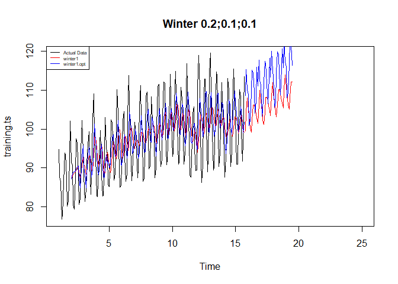<!-- -->

#### Akurasi Data Latih

``` r
#Akurasi data training
SSE1<-winter1$SSE
MSE1<-winter1$SSE/length(training.ts)
RMSE1<-sqrt(MSE1)
akurasi1 <- matrix(c(SSE1,MSE1,RMSE1))
row.names(akurasi1)<- c("SSE", "MSE", "RMSE")
colnames(akurasi1) <- c("Akurasi")
akurasi1
```

    ##          Akurasi
    ## SSE  19249.76741
    ## MSE    100.25921
    ## RMSE    10.01295

``` r
SSE1.opt<-winter1.opt$SSE
MSE1.opt<-winter1.opt$SSE/length(training.ts)
RMSE1.opt<-sqrt(MSE1.opt)
akurasi1.opt <- matrix(c(SSE1.opt,MSE1.opt,RMSE1.opt))
row.names(akurasi1.opt)<- c("SSE1.opt", "MSE1.opt", "RMSE1.opt")
colnames(akurasi1.opt) <- c("Akurasi")
akurasi1.opt
```

    ##                Akurasi
    ## SSE1.opt  13896.693461
    ## MSE1.opt     72.378612
    ## RMSE1.opt     8.507562

``` r
akurasi1.train = data.frame(Model_Winter = c("Winter 1","Winter1 optimal"),
                            Nilai_SSE=c(SSE1,SSE1.opt),
                            Nilai_MSE=c(MSE1,MSE1.opt),Nilai_RMSE=c(RMSE1,RMSE1.opt))
akurasi1.train
```

    ##      Model_Winter Nilai_SSE Nilai_MSE Nilai_RMSE
    ## 1        Winter 1  19249.77 100.25921  10.012952
    ## 2 Winter1 optimal  13896.69  72.37861   8.507562

#### Akurasi Data Uji

``` r
#Akurasi Data Testing
forecast1<-data.frame(forecast1)
testing.ts<-data.frame(testing.ts)
selisih1<-forecast1-testing.ts
SSEtesting1<-sum(selisih1^2)
MSEtesting1<-SSEtesting1/length(testing.ts)

forecast1.opt<-data.frame(forecast1.opt)
selisih1.opt<-forecast1.opt-testing.ts
SSEtesting1.opt<-sum(selisih1.opt^2)
MSEtesting1.opt<-SSEtesting1.opt/length(testing.ts)
```

``` r
akurasi_testing <- data.frame(
  Model = c("Model1", "Model Optimum"),
  SSE   = c(SSEtesting1, SSEtesting1.opt),
  MSE   = c(MSEtesting1, MSEtesting1.opt)
)

akurasi_testing
```

    ##           Model       SSE       MSE
    ## 1        Model1  6589.276  6589.276
    ## 2 Model Optimum 11578.072 11578.072

### Winter Multiplikatif

Model multiplikatif digunakan cocok digunakan jika plot data asli
menunjukkan fluktuasi musiman yang bervariasi.

#### Pemulusan

``` r
#Pemulusan dengan winter multiplikatif 
winter2 <- HoltWinters(training.ts,alpha=0.2,beta=0.1,gamma=0.3,seasonal = "multiplicative")
winter2$fitted
```

    ## Time Series:
    ## Start = c(2, 1) 
    ## End = c(15, 10) 
    ## Frequency = 13 
    ##                xhat     level         trend    season
    ##  2.000000  88.53261  87.09424  0.1827109045 1.0143871
    ##  2.076923  89.35114  87.79949  0.2349649788 1.0149565
    ##  2.153846  80.24923  88.30776  0.2622954117 0.9060538
    ##  2.230769  79.27077  88.62929  0.2682192600 0.8917097
    ##  2.307692  87.01558  88.92396  0.2708642461 0.9755676
    ##  2.384615  96.19416  89.36447  0.2878291241 1.0729692
    ##  2.461538  96.06461  89.89390  0.3119889327 1.0649483
    ##  2.538462  96.16187  90.27182  0.3185824660 1.0615017
    ##  2.615385  88.25357  88.90655  0.1501970777 0.9909813
    ##  2.692308  79.77034  87.52036 -0.0034420368 0.9114848
    ##  2.769231  81.45889  88.05059  0.0499250122 0.9246131
    ##  2.846154  94.18287  90.92384  0.3322574326 1.0320721
    ##  2.923077 106.25007  92.81553  0.4882006614 1.1387548
    ##  3.000000  93.46197  91.20474  0.2783017380 1.0216317
    ##  3.076923  92.30178  90.43192  0.1731900926 1.0187259
    ##  3.153846  80.18948  88.47318 -0.0400032385 0.9067805
    ##  3.230769  79.77237  89.37403  0.0540816599 0.8920280
    ##  3.307692  90.21214  91.95454  0.3067245472 0.9777900
    ##  3.384615 101.04367  93.44425  0.4250231729 1.0764297
    ##  3.461538 100.14205  93.55838  0.3939339204 1.0658817
    ##  3.538462  95.89750  92.22149  0.2208517869 1.0373764
    ##  3.615385  87.26861  89.98293 -0.0250898510 0.9701057
    ##  3.692308  82.72934  90.11707 -0.0091659726 0.9181141
    ##  3.769231  90.94402  94.40508  0.4205508742 0.9590659
    ##  3.846154 104.66983  98.61350  0.7993377080 1.0528804
    ##  3.923077 109.23068  97.98853  0.6569069904 1.1073060
    ##  4.000000  96.75250  95.68286  0.3606495383 1.0073820
    ##  4.076923  92.38005  93.29629  0.0859275109 0.9892681
    ##  4.153846  83.81772  91.39417 -0.1128770171 0.9182354
    ##  4.230769  85.45819  92.71399  0.0303930079 0.9214379
    ##  4.307692  94.60832  95.04857  0.2608113224 0.9926444
    ##  4.384615 103.63941  96.30573  0.3604457716 1.0721373
    ##  4.461538  97.80625  93.80116  0.0739449194 1.0418763
    ##  4.538462  91.06052  90.97260 -0.2163054328 1.0033521
    ##  4.615385  86.28690  89.13601 -0.3783346868 0.9721627
    ##  4.692308  87.05379  90.14658 -0.2394443535 0.9682634
    ##  4.769231  93.59512  93.19998  0.0898402441 1.0032726
    ##  4.846154  96.96847  93.61124  0.1219827348 1.0345155
    ##  4.923077  99.22324  93.01543  0.0502027675 1.0661641
    ##  5.000000  87.79593  90.54665 -0.2016953336 0.9717857
    ##  5.076923  86.28955  89.81792 -0.2543989997 0.9634453
    ##  5.153846  85.00109  90.99589 -0.1111620516 0.9352627
    ##  5.230769  89.95472  94.60387  0.2607528223 0.9482431
    ##  5.307692  98.32000  97.32698  0.5069887906 1.0049678
    ##  5.384615 100.43759  96.83671  0.4072623072 1.0328413
    ##  5.461538  94.95598  94.62258  0.1451235701 1.0019867
    ##  5.538462  91.77859  93.49402  0.0177549954 0.9814656
    ##  5.615385  94.60933  95.35019  0.2015964981 0.9901366
    ##  5.692308 100.13739  98.69709  0.5161262797 1.0093151
    ##  5.769231 101.28129  99.94716  0.5895208040 1.0074064
    ##  5.846154 102.14189  99.20095  0.4559482280 1.0249355
    ##  5.923077  99.39523  96.32403  0.1226610371 1.0305717
    ##  6.000000  90.31449  93.74335 -0.1476729777 0.9649430
    ##  6.076923  91.90313  93.75353 -0.1318874069 0.9816441
    ##  6.153846  93.82687  95.72360  0.0783082468 0.9793841
    ##  6.230769  96.01347  97.97498  0.2956147751 0.9770316
    ##  6.307692  97.13890  97.63602  0.2321578999 0.9925483
    ##  6.384615  95.60013  95.72537  0.0178772024 0.9985051
    ##  6.461538  92.85689  94.33582 -0.1228657071 0.9856064
    ##  6.538462  96.87797  96.38135  0.0939735919 1.0041736
    ##  6.615385 103.06711  99.83024  0.4294659819 1.0280013
    ##  6.692308 103.19638 100.86124  0.4896193790 1.0182092
    ##  6.769231  99.26808  99.82004  0.3365373227 0.9911289
    ##  6.846154  95.98688  97.62517  0.0833960170 0.9823794
    ##  6.923077  95.74407  96.29227 -0.0582331575 0.9949086
    ##  7.000000  92.94046  96.18588 -0.0630490484 0.9668926
    ##  7.076923  98.81105  97.95434  0.1201014538 1.0075107
    ##  7.153846  99.03531  98.35065  0.1477230448 1.0054512
    ##  7.230769  94.56569  97.50155  0.0480402216 0.9694115
    ##  7.307692  92.72518  96.09727 -0.0971920884 0.9658866
    ##  7.384615  93.35030  95.35594 -0.1616050529 0.9806287
    ##  7.461538  99.00402  97.71843  0.0908044867 1.0122155
    ##  7.538462 105.03356 100.21137  0.3310176930 1.0446695
    ##  7.615385 103.73062  99.91940  0.2687192957 1.0353585
    ##  7.692308  99.38981  99.26591  0.1764976955 0.9994711
    ##  7.769231  92.93362  96.85860 -0.0818831413 0.9602890
    ##  7.846154  92.05196  95.58744 -0.2008101981 0.9650405
    ##  7.923077  96.33428  96.93178 -0.0462956801 0.9943108
    ##  8.000000  98.36221  99.30240  0.1953957420 0.9885868
    ##  8.076923 103.28299 101.74828  0.4204440891 1.0109062
    ##  8.153846 100.98221 101.34421  0.3379934370 0.9931159
    ##  8.230769  94.73900  99.42154  0.1119269153 0.9518306
    ##  8.307692  94.51815  98.63409  0.0219886463 0.9580571
    ##  8.384615 102.94833 101.51761  0.3081417194 1.0110246
    ##  8.461538 106.70059 102.12724  0.3382906693 1.0413316
    ##  8.538462 105.45757 101.47046  0.2387835794 1.0368534
    ##  8.615385 102.84323 100.34822  0.1026819546 1.0238158
    ##  8.692308  94.09543  97.45546 -0.1968626872 0.9674767
    ##  8.769231  90.93956  96.41657 -0.2810657930 0.9459519
    ##  8.846154  96.46524  98.16200 -0.0784160941 0.9835004
    ##  8.923077 103.60955 101.02919  0.2161452365 1.0233513
    ##  9.000000 104.69135 102.79117  0.3707284352 1.0148257
    ##  9.076923 101.70248 101.40236  0.1947741562 1.0010369
    ##  9.153846  95.92768  99.33374 -0.0315646779 0.9660179
    ##  9.230769  92.68928  98.56284 -0.1054986990 0.9414156
    ##  9.307692  99.81572 100.66183  0.1149506849 0.9904634
    ##  9.384615 105.12424 103.24873  0.3621457722 1.0146062
    ##  9.461538 108.49481 104.93468  0.4945254804 1.0290774
    ##  9.538462 106.01147 103.62131  0.3137361078 1.0199781
    ##  9.615385  99.56343 100.95581  0.0158126979 0.9860535
    ##  9.692308  95.07612  99.44945 -0.1364047115 0.9573376
    ##  9.769231  97.45291 100.54385 -0.0133241229 0.9693862
    ##  9.846154 104.65436 102.61756  0.1953789005 1.0179104
    ##  9.923077 109.44368 104.66953  0.3810385386 1.0418190
    ## 10.000000 103.10656 103.53167  0.2291487498 0.9936945
    ## 10.076923  99.07431 101.72805  0.0258718767 0.9736657
    ## 10.153846  96.31956 100.69366 -0.0801543902 0.9573223
    ## 10.230769  99.44740 102.79318  0.1378128134 0.9661560
    ## 10.307692 108.58852 106.11592  0.4563059634 1.0189195
    ## 10.384615 110.15718 106.50290  0.4493727539 1.0299658
    ## 10.461538 106.11909 105.06510  0.2606561821 1.0075321
    ## 10.538462 100.63282 102.32344 -0.0395761486 0.9838583
    ## 10.615385  96.93247 100.37342 -0.2306203992 0.9679425
    ## 10.692308  98.60592 101.59446 -0.0854540957 0.9714007
    ## 10.769231 103.45229 104.01203  0.1648479002 0.9930446
    ## 10.846154 109.41878 105.00548  0.2477085164 1.0395769
    ## 10.923077 105.44358 103.00218  0.0226076830 1.0234778
    ## 11.000000  96.93067 100.20193 -0.2596785244 0.9698668
    ## 11.076923  95.14966  99.29784 -0.3241197648 0.9613629
    ## 11.153846 100.04880 101.94293 -0.0271989041 0.9816817
    ## 11.230769 105.75038 105.33492  0.3147203969 1.0009535
    ## 11.307692 107.58715 105.38386  0.2881421925 1.0181235
    ## 11.384615 104.66325 103.75981  0.0969228338 1.0077657
    ## 11.461538  97.55474 100.58892 -0.2298584078 0.9720571
    ## 11.538462  94.08311  98.29783 -0.4359807662 0.9613869
    ## 11.615385  96.63056  98.51832 -0.3703340921 0.9845394
    ## 11.692308  99.34954  99.62645 -0.2224874086 0.9994525
    ## 11.769231 100.83629 100.68448 -0.0944361484 1.0024480
    ## 11.846154 100.41036  99.40215 -0.2132251807 1.0123142
    ## 11.923077  95.48671  96.99343 -0.4327747567 0.9888780
    ## 12.000000  91.19320  95.32123 -0.5567174431 0.9623139
    ## 12.076923  98.16691  98.81541 -0.1516272151 0.9949640
    ## 12.153846 105.17655 102.85483  0.2674771768 1.0199204
    ## 12.230769 104.32817 104.17268  0.3725138619 0.9979242
    ## 12.307692 103.12657 103.33047  0.2510422764 0.9956079
    ## 12.384615  96.95865 100.20136 -0.0869737416 0.9684788
    ## 12.461538  93.46784  98.85008 -0.2134040283 0.9475972
    ## 12.538462  97.82865 100.93427  0.0163552048 0.9690743
    ## 12.615385 104.58355 104.04181  0.3254739572 1.0020722
    ## 12.692308 108.08535 106.02741  0.4914869650 1.0147058
    ## 12.769231 104.02783 104.94910  0.3345064967 0.9880725
    ## 12.846154 100.70286 102.22659  0.0288055592 0.9848171
    ## 12.923077  97.84440 100.64538 -0.1321961895 0.9734484
    ## 13.000000 105.11097 103.89954  0.2064391617 1.0096535
    ## 13.076923 112.13127 106.95389  0.4912306168 1.0436143
    ## 13.153846 110.38355 106.53368  0.4000864320 1.0322610
    ## 13.230769 103.23469 104.74813  0.1815224349 0.9838467
    ## 13.307692  97.44901 102.10881 -0.1005619379 0.9553052
    ## 13.384615  95.56008 100.46335 -0.2550509841 0.9536144
    ## 13.461538  98.93321 101.73100 -0.1027815483 0.9734817
    ## 13.538462 105.47109 104.86887  0.2212839501 1.0036249
    ## 13.615385 109.33067 106.70923  0.3831912125 1.0209002
    ## 13.692308 104.98142 105.16089  0.1900387879 0.9964925
    ## 13.769231  97.46417 102.41567 -0.1034871288 0.9526154
    ## 13.846154  97.90938 101.54490 -0.1802162895 0.9659122
    ## 13.923077 104.52088 103.31554  0.0148701359 1.0115210
    ## 14.000000 109.36382 104.80220  0.1620487953 1.0419150
    ## 14.076923 107.27727 103.81331  0.0469545448 1.0329000
    ## 14.153846 101.63699 101.20752 -0.2183192677 1.0064144
    ## 14.230769  92.92857  98.19107 -0.4981321764 0.9512312
    ## 14.307692  91.10083  97.65756 -0.5016701188 0.9376768
    ## 14.384615  96.11288  99.29718 -0.2875414910 0.9707427
    ## 14.461538 103.53990 102.49621  0.0611156284 1.0095807
    ## 14.538462 106.27300 103.80937  0.1863201645 1.0218982
    ## 14.615385 101.96682 102.13055 -0.0001936158 0.9983987
    ## 14.692308  95.81515  99.80938 -0.2322916359 0.9622209
    ## 14.769231  93.46126  99.27083 -0.2629176749 0.9439777
    ## 14.846154 100.25923 101.51029 -0.0126798894 0.9877989
    ## 14.923077 107.87566 104.58361  0.2959208571 1.0285673
    ## 15.000000 107.87494 104.65754  0.2737217585 1.0280533
    ## 15.076923 104.20359 103.98187  0.1787823748 1.0004122
    ## 15.153846  98.59750 101.52286 -0.0849966184 0.9719989
    ## 15.230769  94.72519  99.86706 -0.2420769598 0.9508176
    ## 15.307692  96.92941 100.88085 -0.1164901618 0.9619414
    ## 15.384615 104.74592 103.51268  0.1583413438 1.0103683
    ## 15.461538 107.10612 104.34992  0.2262311270 1.0241926
    ## 15.538462 103.07030 103.04807  0.0734236000 0.9995035
    ## 15.615385  97.74427 100.86374 -0.1523525163 0.9705384
    ## 15.692308  96.30204 100.61680 -0.1618105752 0.9586586

``` r
xhat2 <- winter2$fitted[,2]

winter2.opt<- HoltWinters(training.ts, alpha= NULL,  beta = NULL, gamma = NULL, seasonal = "multiplicative")
winter2.opt$fitted
```

    ## Time Series:
    ## Start = c(2, 1) 
    ## End = c(15, 10) 
    ## Frequency = 13 
    ##                xhat     level     trend    season
    ##  2.000000  88.53261  87.09424 0.1827109 1.0143871
    ##  2.076923  89.85599  88.34915 0.1827109 1.0149565
    ##  2.153846  80.70334  88.88853 0.1827109 0.9060538
    ##  2.230769  79.51360  88.98712 0.1827109 0.8917097
    ##  2.307692  87.11336  89.11235 0.1827109 0.9755676
    ##  2.384615  96.33626  89.60203 0.1827109 1.0729692
    ##  2.461538  96.28074  90.22613 0.1827109 1.0649483
    ##  2.538462  96.21829  90.46084 0.1827109 1.0615017
    ##  2.615385  86.56156  87.16663 0.1827109 0.9909813
    ##  2.692308  77.54931  84.89750 0.1827109 0.9114848
    ##  2.769231  80.77230  87.17523 0.1827109 0.9246131
    ##  2.846154  96.64178  93.45588 0.1827109 1.0320721
    ##  2.923077 109.36987  95.86067 0.1827109 1.1387548
    ##  3.000000  93.70705  90.61214 0.1827109 1.0320744
    ##  3.076923  90.59173  88.56243 0.1827109 1.0208077
    ##  3.153846  77.13591  85.06700 0.1827109 0.9048231
    ##  3.230769  79.06775  88.56937 0.1827109 0.8908833
    ##  3.307692  92.59594  94.26733 0.1827109 0.9803696
    ##  3.384615 103.78942  95.87317 0.1827109 1.0805108
    ##  3.461538 100.78495  94.37753 0.1827109 1.0658280
    ##  3.538462  91.00444  90.76103 0.1827109 1.0006674
    ##  3.615385  83.49430  87.71880 0.1827109 0.9498619
    ##  3.692308  84.91196  89.86589 0.1827109 0.9429571
    ##  3.769231  98.97174  97.68380 0.1827109 1.0112932
    ##  3.846154 108.95070 101.97984 0.1827109 1.0664446
    ##  3.923077 101.79227  97.62984 0.1827109 1.0406872
    ##  4.000000  93.95942  94.27772 0.1827109 0.9946960
    ##  4.076923  86.24818  89.90384 0.1827109 0.9573924
    ##  4.153846  84.56313  88.49984 0.1827109 0.9535486
    ##  4.230769  88.24762  91.19265 0.1827109 0.9657705
    ##  4.307692  95.00497  94.70100 0.1827109 1.0012780
    ##  4.384615 102.05857  96.74792 0.1827109 1.0529032
    ##  4.461538  91.90183  91.56065 0.1827109 1.0017272
    ##  4.538462  83.55005  87.96788 0.1827109 0.9478105
    ##  4.615385  86.27732  87.88294 0.1827109 0.9796932
    ##  4.692308  95.52978  90.89766 0.1827109 1.0488515
    ##  4.769231 100.76753  94.00147 0.1827109 1.0698987
    ##  4.846154  91.80141  92.05151 0.1827109 0.9953074
    ##  4.923077  91.58649  92.83381 0.1827109 0.9846261
    ##  5.000000  83.72803  90.60269 0.1827109 0.9222632
    ##  5.076923  85.47422  91.45600 0.1827109 0.9327305
    ##  5.153846  94.38371  95.03332 0.1827109 0.9912586
    ##  5.230769 100.14578  98.53188 0.1827109 1.0144983
    ##  5.307692 102.38262  99.31470 0.1827109 1.0289978
    ##  5.384615  92.62050  95.87866 0.1827109 0.9641805
    ##  5.461538  88.17674  93.62665 0.1827109 0.9399567
    ##  5.538462  88.86090  93.98320 0.1827109 0.9436632
    ##  5.615385 101.88481  99.35813 0.1827109 1.0235478
    ##  5.692308 112.90948 102.86700 0.1827109 1.0956797
    ##  5.769231 103.25886  99.65327 0.1827109 1.0342850
    ##  5.846154  97.00321  96.38176 0.1827109 1.0045435
    ##  5.923077  86.99401  91.68618 0.1827109 0.9469366
    ##  6.000000  85.17274  91.20638 0.1827109 0.9319793
    ##  6.076923  92.34426  93.98854 0.1827109 0.9805992
    ##  6.153846 102.34633  98.30426 0.1827109 1.0391865
    ##  6.230769 101.82672  99.32491 0.1827109 1.0233057
    ##  6.307692  93.53970  95.93311 0.1827109 0.9731978
    ##  6.384615  86.62670  93.14927 0.1827109 0.9281567
    ##  6.461538  88.94459  94.19275 0.1827109 0.9424547
    ##  6.538462 102.37957 100.73210 0.1827109 1.0145148
    ##  6.615385 113.20001 105.50318 0.1827109 1.0710986
    ##  6.692308 107.50677 102.98819 0.1827109 1.0420260
    ##  6.769231  96.71634  98.40403 0.1827109 0.9810279
    ##  6.846154  87.75526  94.40647 0.1827109 0.9277516
    ##  6.923077  89.33483  95.15314 0.1827109 0.9370539
    ##  7.000000  95.17698  98.03785 0.1827109 0.9690128
    ##  7.076923 105.23727 101.02324 0.1827109 1.0398329
    ##  7.153846 104.54889  99.21892 0.1827109 1.0517825
    ##  7.230769  92.47249  95.29506 0.1827109 0.9685238
    ##  7.307692  86.89044  93.38193 0.1827109 0.9286675
    ##  7.384615  89.28659  94.76837 0.1827109 0.9403430
    ##  7.461538 105.16305 102.12565 0.1827109 1.0279028
    ##  7.538462 113.05719 104.70315 0.1827109 1.0779068
    ##  7.615385 103.87759 100.59221 0.1827109 1.0307881
    ##  7.692308  95.97917  98.81572 0.1827109 0.9695020
    ##  7.769231  87.41478  94.97650 0.1827109 0.9186161
    ##  7.846154  89.12684  95.07371 0.1827109 0.9356518
    ##  7.923077  97.40834  99.80948 0.1827109 0.9741595
    ##  8.000000 105.58459 104.60160 0.1827109 1.0076375
    ##  8.076923 107.61235 106.37332 0.1827109 1.0099132
    ##  8.153846 101.90838 103.10331 0.1827109 0.9866619
    ##  8.230769  92.24318  98.23178 0.1827109 0.9372927
    ##  8.307692  92.49618  97.63318 0.1827109 0.9456151
    ##  8.384615 108.52078 104.64225 0.1827109 1.0352570
    ##  8.461538 109.78091 103.22016 0.1827109 1.0616815
    ##  8.538462 101.57719 100.20955 0.1827109 1.0118030
    ##  8.615385  99.42846  99.10430 0.1827109 1.0014247
    ##  8.692308  86.12138  94.40256 0.1827109 0.9105158
    ##  8.769231  88.55589  96.34342 0.1827109 0.9174292
    ##  8.846154 101.75387 101.87985 0.1827109 0.9969755
    ##  8.923077 109.83049 105.84806 0.1827109 1.0358360
    ##  9.000000 110.01030 106.69981 0.1827109 1.0292637
    ##  9.076923  97.46338 101.20200 0.1827109 0.9613222
    ##  9.153846  90.03918  98.35822 0.1827109 0.9137237
    ##  9.230769  92.43338  99.58176 0.1827109 0.9265160
    ##  9.307692 108.24064 104.47398 0.1827109 1.0342448
    ##  9.384615 107.64421 106.17123 0.1827109 1.0121318
    ##  9.461538 109.65286 108.05514 0.1827109 1.0130731
    ##  9.538462 103.44461 104.00051 0.1827109 0.9929105
    ##  9.615385  91.90737  98.96436 0.1827109 0.9269802
    ##  9.692308  92.87522  99.21407 0.1827109 0.9343887
    ##  9.769231 101.76152 102.95094 0.1827109 0.9866956
    ##  9.846154 110.82824 105.54890 0.1827109 1.0482034
    ##  9.923077 112.03849 107.01395 0.1827109 1.0451677
    ## 10.000000  97.70480 103.07116 0.1827109 0.9462580
    ## 10.076923  93.16784 101.21640 0.1827109 0.9188230
    ## 10.153846  94.52006 101.73175 0.1827109 0.9274450
    ## 10.230769 106.06110 107.32729 0.1827109 0.9865232
    ## 10.307692 117.51478 111.15904 0.1827109 1.0554422
    ## 10.384615 111.69627 107.73366 0.1827109 1.0350262
    ## 10.461538  98.84435 103.45277 0.1827109 0.9537694
    ## 10.538462  92.17238 100.25786 0.1827109 0.9176808
    ## 10.615385  92.97723 100.02129 0.1827109 0.9278795
    ## 10.692308 103.21582 105.06061 0.1827109 0.9807351
    ## 10.769231 110.66191 108.40142 0.1827109 1.0191352
    ## 10.846154 114.64360 107.33769 0.1827109 1.0662498
    ## 10.923077  99.67739 101.00613 0.1827109 0.9850631
    ## 11.000000  89.82673  97.57292 0.1827109 0.9188906
    ## 11.076923  92.05120  99.53266 0.1827109 0.9231395
    ## 11.153846 107.04427 107.43761 0.1827109 0.9946474
    ## 11.230769 115.53779 111.65848 0.1827109 1.0330523
    ## 11.307692 108.10847 107.42471 0.1827109 1.0046563
    ## 11.384615 100.58245 103.41822 0.1827109 0.9708643
    ## 11.461538  89.44296  98.36577 0.1827109 0.9076037
    ## 11.538462  89.27178  97.68650 0.1827109 0.9121538
    ## 11.615385 100.56970 101.45356 0.1827109 0.9895060
    ## 11.692308 105.45217 103.02103 0.1827109 1.0217864
    ## 11.769231 103.72615 103.32279 0.1827109 1.0021317
    ## 11.846154  96.80933  99.88387 0.1827109 0.9674492
    ## 11.923077  90.52228  96.88022 0.1827109 0.9326143
    ## 12.000000  91.16764  96.55083 0.1827109 0.9424615
    ## 12.076923 107.36168 105.23185 0.1827109 1.0184711
    ## 12.153846 115.40337 110.11078 0.1827109 1.0463299
    ## 12.230769 105.52956 108.38328 0.1827109 0.9720315
    ## 12.307692  99.99543 105.49989 0.1827109 0.9461862
    ## 12.384615  89.59563  99.74260 0.1827109 0.8966260
    ## 12.461538  90.21541 100.49321 0.1827109 0.8960972
    ## 12.538462 102.87438 107.15081 0.1827109 0.9584553
    ## 12.615385 112.73185 111.58620 0.1827109 1.0086155
    ## 12.692308 114.65062 111.83790 0.1827109 1.0234780
    ## 12.769231 101.05064 106.19466 0.1827109 0.9499262
    ## 12.846154  93.39153 101.13896 0.1827109 0.9217330
    ## 12.923077  93.68900 101.04717 0.1827109 0.9255073
    ## 13.000000 116.29239 110.38086 0.1827109 1.0518147
    ## 13.076923 121.05116 111.81039 0.1827109 1.0808805
    ## 13.153846 109.10540 106.80074 0.1827109 1.0198344
    ## 13.230769  96.07012 102.95840 0.1827109 0.9314436
    ## 13.307692  86.83997 100.18397 0.1827109 0.8652271
    ## 13.384615  92.27190 101.89860 0.1827109 0.9039059
    ## 13.461538 104.25868 106.87043 0.1827109 0.9738965
    ## 13.538462 112.85947 111.45579 0.1827109 1.0109368
    ## 13.615385 113.18630 111.93741 0.1827109 1.0095093
    ## 13.692308 100.62319 106.54471 0.1827109 0.9428054
    ## 13.769231  90.07018 102.25860 0.1827109 0.8792369
    ## 13.846154  95.82520 104.18663 0.1827109 0.9181355
    ## 13.923077 113.61614 109.51221 0.1827109 1.0357466
    ## 14.000000 116.72322 109.04055 0.1827109 1.0686663
    ## 14.076923 104.83834 104.09465 0.1827109 1.0053798
    ## 14.153846  96.12373  99.68072 0.1827109 0.9625519
    ## 14.230769  85.97748  96.21085 0.1827109 0.8919421
    ## 14.307692  88.12381  99.51433 0.1827109 0.8839160
    ## 14.384615 101.90875 105.74016 0.1827109 0.9621033
    ## 14.461538 114.08514 110.66903 0.1827109 1.0291686
    ## 14.538462 110.96977 109.16701 0.1827109 1.0148154
    ## 14.615385  96.88938 103.59658 0.1827109 0.9336100
    ## 14.692308  89.33367 100.91822 0.1827109 0.8836088
    ## 14.769231  93.28991 103.42685 0.1827109 0.9003986
    ## 14.846154 107.07768 109.07083 0.1827109 0.9800843
    ## 14.923077 115.99251 112.78056 0.1827109 1.0268161
    ## 15.000000 108.68158 109.26298 0.1827109 0.9930184
    ## 15.076923 100.70952 107.09553 0.1827109 0.9387693
    ## 15.153846  93.93569 103.03776 0.1827109 0.9100491
    ## 15.230769  95.13584 101.88013 0.1827109 0.9321301
    ## 15.307692 100.13873 104.51063 0.1827109 0.9564956
    ## 15.384615 111.50513 108.98780 0.1827109 1.0213851
    ## 15.461538 108.70123 107.83274 0.1827109 1.0063489
    ## 15.538462  97.45285 104.17391 0.1827109 0.9338445
    ## 15.615385  91.39364 101.86678 0.1827109 0.8955816
    ## 15.692308  95.71457 104.74922 0.1827109 0.9121587

``` r
xhat2.opt <- winter2.opt$fitted[,2]
```

#### Peramalan

``` r
#Forecast
forecast2 <- predict(winter2, n.ahead = 49)
forecast2.opt <- predict(winter2.opt, n.ahead = 49)
```

#### Plot Deret Waktu

``` r
#Plot time series
plot(training.ts,main="Winter 0.2;0.1;0.1",type="l",col="black",
     xlim=c(1,25),pch=12)
lines(xhat2,type="l",col="red")
lines(xhat2.opt,type="l",col="blue")
lines(forecast2,type="l",col="red")
lines(forecast2.opt,type="l",col="blue")
legend("topleft",c("Actual Data",expression(paste(winter2)),
                   expression(paste(winter2.opt))),cex=0.5,
       col=c("black","red","blue"),lty=1)
```

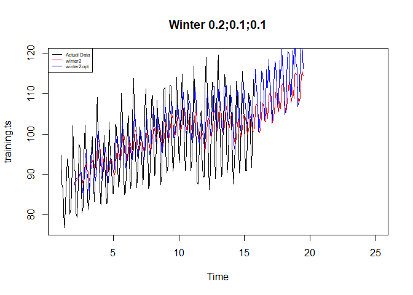<!-- -->

#### Akurasi Data Latih

``` r
#Akurasi data training
SSE2<-winter2$SSE
MSE2<-winter2$SSE/length(training.ts)
RMSE2<-sqrt(MSE2)
akurasi1 <- matrix(c(SSE2,MSE2,RMSE2))
row.names(akurasi1)<- c("SSE2", "MSE2", "RMSE2")
colnames(akurasi1) <- c("Akurasi lamda=0.2")
akurasi1
```

    ##       Akurasi lamda=0.2
    ## SSE2       18378.242877
    ## MSE2          95.720015
    ## RMSE2          9.783661

``` r
SSE2.opt<-winter2.opt$SSE
MSE2.opt<-winter2.opt$SSE/length(training.ts)
RMSE2.opt<-sqrt(MSE2.opt)
akurasi1.opt <- matrix(c(SSE2.opt,MSE2.opt,RMSE2.opt))
row.names(akurasi1.opt)<- c("SSE2.opt", "MSE2.opt", "RMSE2.opt")
colnames(akurasi1.opt) <- c("Akurasi")
akurasi1.opt
```

    ##                Akurasi
    ## SSE2.opt  14014.482201
    ## MSE2.opt     72.992095
    ## RMSE2.opt     8.543541

``` r
akurasi2.train = data.frame(Model_Winter = c("Winter 1","winter2 optimal"),
                            Nilai_SSE=c(SSE2,SSE2.opt),
                            Nilai_MSE=c(MSE2,MSE2.opt),Nilai_RMSE=c(RMSE2,RMSE2.opt))
akurasi2.train
```

    ##      Model_Winter Nilai_SSE Nilai_MSE Nilai_RMSE
    ## 1        Winter 1  18378.24  95.72001   9.783661
    ## 2 winter2 optimal  14014.48  72.99209   8.543541

#### Akurasi Data Uji

``` r
#Akurasi Data Testing
forecast2<-data.frame(forecast2)
testing.ts<-data.frame(testing.ts)
selisih2<-forecast2-testing.ts
SSEtesting2<-sum(selisih2^2)
MSEtesting2<-SSEtesting2/length(testing.ts)

forecast2.opt<-data.frame(forecast2.opt)
selisih2.opt<-forecast2.opt-testing.ts
SSEtesting2.opt<-sum(selisih2.opt^2)
MSEtesting2.opt<-SSEtesting2.opt/length(testing.ts)
```

``` r
# Atau rapikan dalam tabel
akurasi_testing2 <- data.frame(
  Model = c("Model2", "Model2 Optimal"),
  SSE   = c(SSEtesting2, SSEtesting2.opt),
  MSE   = c(MSEtesting2, MSEtesting2.opt)
)

akurasi_testing2
```

    ##            Model       SSE       MSE
    ## 1         Model2  7515.364  7515.364
    ## 2 Model2 Optimal 12039.461 12039.461

## Tugas

1.  Setiap kelompok memilih satu data time series dengan panjang ≥ 500
    periode.

2.  Data dibagi rata ke setiap anggota; minimal 100 observasi per orang.

3.  Terapkan metode pemulusan yang sudah dipelajari (SMA, DMA, SES, DES,
    atau Holt-Winters) pada bagian data masing-masing

4.  Bandingkan kinerja metode dan tentukan metode terbaik untuk data
    tersebut menggunakan metrik akurasi (mis. SSE/MSE/RMSE/MAPE), lalu
    jelaskan alasannya secara singkat.

    Upload tugas per individu ke GitHub pada folder `Pertemuan-2` dengan
    format HTML bernama `Tugas-Pertemuan-2.html`.

5.  Deadline Pengumpulan : **Selasa, Jam 23.59 WIB**
