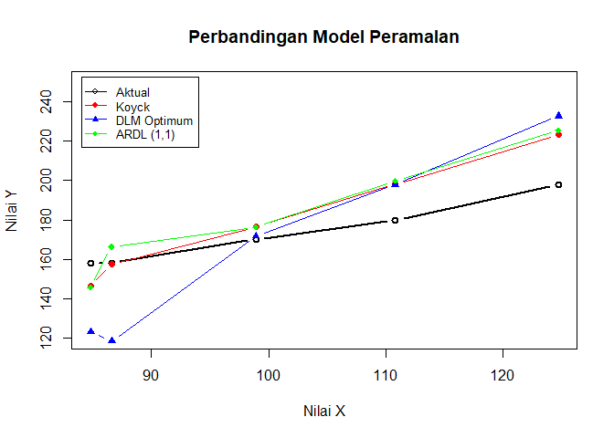

Pertemuan 3 Regresi dengan Peubah Lag
================
Muhammad Khayruhanif

<style>
h1, h2, h3, h4, h5, h6 {
  font-weight: bold !important;
}
</style>

## Pengantar

Dalam pemodelan deret waktu, sering kali efek dari suatu kejadian
(variabel X) terhadap target observasi (variabel Y) tidak terjadi secara
instan, melainkan membutuhkan jeda waktu atau **Lag**.

Secara umum, terdapat tiga pendekatan utama untuk memodelkan efek jeda
waktu ini:

1\. **Distributed Lag Model (DLM):** Variabel dependen (Y) dipengaruhi
oleh variabel independen saat ini dan masa lalu
(,
dst).

2\. **Autoregressive Model (AR):** Variabel dependen (Y) dipengaruhi
oleh variabel independen saat ini
() dan nilai
dirinya sendiri di masa lalu
(,
dst).

3\. **Autoregressive Distributed Lag (ARDL):** Model gabungan di mana Y
dipengaruhi oleh X saat ini, X masa lalu, dan Y masa lalu.

------------------------------------------------------------------------

## 1. Persiapan Data

### *Packages*

``` r
# Mengaktifkan library yang dibutuhkan
# install.packages(c("dLagM", "dynlm", "MLmetrics", "lmtest", "car")) # Run jika belum meng-install

library(dLagM)
library(dynlm)
library(MLmetrics)
library(lmtest)
library(car)
```

### Impor & Pembagian Data

Kita akan menggunakan data simulasi untuk melatih pemodelan. Data dibagi
menjadi data Training (untuk membentuk model) dan data Testing (untuk
menguji akurasi ramalan).

``` r
# Impor Data
data <- rio::import("https://raw.githubusercontent.com/rizkynurhambali/praktikum-sta1341/main/Pertemuan%203/Data%20Asli.csv")

# Membagi data (15 observasi pertama untuk training, 5 observasi terakhir untuk testing)
train <- data[1:15,]
test <- data[16:20,]

# Mengubah format data menjadi objek Time Series (ts)
train.ts <- ts(train)
test.ts <- ts(test)
data.ts <- ts(data)
```

## 2. Model Koyck

Model Koyck mengatasi masalah infinite distributed lag (pengaruh masa
lalu yang tak terhingga) dengan mengasumsikan bahwa semakin jauh jarak
lag, semakin kecil pengaruhnya.

Melalui transformasi aljabar, efek masa lalu dari X yang sangat panjang
diringkas ke dalam satu variabel saja, yaitu
.
Bentuk persamaannya menjadi:

+\beta_0X_t+\lambda Y_{t-1}+V_t")

Catatan:  adalah
error term gabungan. Pada hasil ringkasan model (estimasi),
 tidak ditampilkan
karena nilai harapannya diasumsikan nol.

### Pemodelan

Pemodelan ini menggunakan fungsi `koyckDlm()`.

``` r
# Membangun Model Koyck
model.koyck <- koyckDlm(x = train$Xt, y = train$Yt)
summary(model.koyck)
```

    ## 
    ## Call:
    ## "Y ~ (Intercept) + Y.1 + X.t"
    ## 
    ## Residuals:
    ##      Min       1Q   Median       3Q      Max 
    ## -3.75605 -1.16407  0.01599  1.17295  3.28003 
    ## 
    ## Coefficients:
    ##             Estimate Std. Error t value Pr(>|t|)    
    ## (Intercept)  -3.7335     2.1785  -1.714   0.1146    
    ## Y.1           0.4214     0.1158   3.639   0.0039 ** 
    ## X.t           1.1510     0.1901   6.055 8.25e-05 ***
    ## ---
    ## Signif. codes:  0 '***' 0.001 '**' 0.01 '*' 0.05 '.' 0.1 ' ' 1
    ## 
    ## Residual standard error: 2.023 on 11 degrees of freedom
    ## Multiple R-Squared: 0.9934,  Adjusted R-squared: 0.9922 
    ## Wald test: 828.9 on 2 and 11 DF,  p-value: 1.01e-12 
    ## 
    ## Diagnostic tests:
    ## NULL
    ## 
    ##                              alpha     beta       phi
    ## Geometric coefficients:  -6.452844 1.150951 0.4214181

**Interpretasi:** Jika *P-value* dari peubah
 dan

,
artinya kedua peubah tersebut berpengaruh signifikan terhadap
. Koefisien pada

mewakili parameter

(tingkat penurunan pengaruh).

**Persamaan:**


### Peramalan

``` r
# Meramalkan 5 periode ke depan
fore.koyck <- forecast(model = model.koyck, x = test$Xt, h = 5)
fore.koyck
```

    ## $forecasts
    ## [1] 146.4180 157.6420 176.5288 198.1843 223.3085
    ## 
    ## $call
    ## forecast.koyckDlm(model = model.koyck, x = test$Xt, h = 5)
    ## 
    ## attr(,"class")
    ## [1] "forecast.koyckDlm" "dLagM"

``` r
# Cek Akurasi (MAPE) pada data testing
mape.koyck <- MAPE(fore.koyck$forecasts, test$Yt)
cat("MAPE Model Koyck:", mape.koyck, "\n")
```

    ## MAPE Model Koyck: 0.06845456

## 3. Regression with Distributed Lag (DLM)

Berbeda dengan Koyck, pemodelan DLM membatasi secara spesifik berapa
periode memori masa lalu yang dilibatkan. Batasan ini direpresentasikan
dengan parameter .

\$\$Y_t=\alpha+\beta_0X_t+\beta_1X\_{t-1}+…+\beta_qX\_{t-q}+e_t\$\$

### Pemodelan (Lag = 2)

Fungsi yang digunakan adalah `dlm()`. Parameter `q = 2` berarti kita
memasukkan
,
dan
.

``` r
model.dlm <- dlm(x = train$Xt, y = train$Yt, q = 2)
summary(model.dlm)
```

    ## 
    ## Call:
    ## lm(formula = model.formula, data = design)
    ## 
    ## Residuals:
    ##     Min      1Q  Median      3Q     Max 
    ## -1.4446 -0.6965 -0.2373  0.8810  1.8630 
    ## 
    ## Coefficients:
    ##             Estimate Std. Error t value Pr(>|t|)    
    ## (Intercept)  -9.6779     1.8156  -5.330 0.000474 ***
    ## x.t           0.3179     0.1792   1.774 0.109856    
    ## x.1           1.5276     0.3487   4.380 0.001770 ** 
    ## x.2           0.2651     0.2440   1.087 0.305388    
    ## ---
    ## Signif. codes:  0 '***' 0.001 '**' 0.01 '*' 0.05 '.' 0.1 ' ' 1
    ## 
    ## Residual standard error: 1.322 on 9 degrees of freedom
    ## Multiple R-squared:  0.9974, Adjusted R-squared:  0.9965 
    ## F-statistic:  1133 on 3 and 9 DF,  p-value: 6.471e-12
    ## 
    ## AIC and BIC values for the model:
    ##       AIC      BIC
    ## 1 49.3705 52.19525

### Penentuan *Lag* Optimum

Untuk menghindari coba-coba, kita bisa mencari nilai
 terbaik berdasarkan
nilai *Akaike Information Criterion (AIC)* terkecil menggunakan fungsi
`finiteDLMauto()`.

``` r
finiteDLMauto(formula = Yt ~ Xt,
              data = data.frame(train), q.min = 1, q.max = 10,
              model.type = "dlm", error.type = "AIC", trace = TRUE)
```

    ##    q - k    MASE       AIC       BIC   GMRAE    MBRAE R.Adj.Sq   Ljung-Box
    ## 7      7 0.00000      -Inf      -Inf 0.00000  0.00000      NaN         NaN
    ## 8      8 0.00000      -Inf      -Inf 0.00000  0.00000      NaN         NaN
    ## 9      9 0.00000      -Inf      -Inf 0.00000  0.00000      NaN         NaN
    ## 10    10 0.00000      -Inf      -Inf 0.00000  0.00000      NaN         NaN
    ## 6      6 0.00214 -29.87368 -28.09865 0.00225  0.00125  0.99999 0.983064249
    ## 5      5 0.05106  26.22283  28.64351 0.05362  0.00407  0.99848 0.008718525
    ## 4      4 0.09175  37.32725  40.11252 0.07960 -0.03335  0.99741 0.136398279
    ## 3      3 0.14898  48.42255  51.33199 0.09585 -0.20490  0.99543 0.524105756
    ## 2      2 0.15958  49.37050  52.19525 0.14914 -0.13532  0.99648 0.738616442
    ## 1      1 0.17862  51.20728  53.76351 0.20782 -0.14048  0.99688 0.801604351

**Interpretasi:** Pilih baris dengan nilai AIC yang paling kecil
(negatif terbesar). Misalnya, lag optimum berada pada
, kita bangun
ulang modelnya:

``` r
# Membangun ulang DLM dengan Lag Optimum (q=6)
model.dlm.opt <- dlm(x = train$Xt, y = train$Yt, q = 6)
summary(model.dlm.opt)
```

    ## 
    ## Call:
    ## lm(formula = model.formula, data = design)
    ## 
    ## Residuals:
    ##         1         2         3         4         5         6         7         8 
    ## -0.023415  0.014375  0.032641 -0.010695 -0.013096 -0.014927  0.010054  0.010809 
    ##         9 
    ## -0.005747 
    ## 
    ## Coefficients:
    ##             Estimate Std. Error t value Pr(>|t|)  
    ## (Intercept) 21.42223    1.44472  14.828   0.0429 *
    ## x.t          1.68749    0.04758  35.466   0.0179 *
    ## x.1         -1.23901    0.11688 -10.600   0.0599 .
    ## x.2          0.97604    0.02787  35.021   0.0182 *
    ## x.3         -0.23945    0.02746  -8.719   0.0727 .
    ## x.4          3.24431    0.14678  22.103   0.0288 *
    ## x.5          0.08560    0.04903   1.746   0.3312  
    ## x.6         -3.47612    0.15157 -22.933   0.0277 *
    ## ---
    ## Signif. codes:  0 '***' 0.001 '**' 0.01 '*' 0.05 '.' 0.1 ' ' 1
    ## 
    ## Residual standard error: 0.05079 on 1 degrees of freedom
    ## Multiple R-squared:      1,  Adjusted R-squared:      1 
    ## F-statistic: 1.277e+05 on 7 and 1 DF,  p-value: 0.002155
    ## 
    ## AIC and BIC values for the model:
    ##         AIC       BIC
    ## 1 -29.87368 -28.09865

``` r
# Peramalan model DLM Optimum
fore.dlm.opt <- forecast(model = model.dlm.opt, x = test$Xt, h = 5)
mape.dlm.opt <- MAPE(fore.dlm.opt$forecasts, test$Yt)
cat("MAPE Model DLM Optimum:", mape.dlm.opt, "\n")
```

    ## MAPE Model DLM Optimum: 0.1511753

## 4. Autoregressive Distributed Lag (ARDL)

Model ARDL menggabungkan pengaruh dari peubah independen masa lalu dan
peubah dependen masa lalu.

**Perhatian Notasi:**

Pada *package* `dLagM` (khusus fungsi `ardlDlm`), aturannya adalah:

-  = panjang *lag*
  peubah independen ().

-  = panjang *lag*
  peubah dependen ().

### Pemodelan

``` r
# Model ARDL dengan lag X = 1 dan lag Y = 1
model.ardl <- ardlDlm(formula = Yt ~ Xt, data = train, p = 1, q = 1)
summary(model.ardl)
```

    ## 
    ## Time series regression with "ts" data:
    ## Start = 2, End = 15
    ## 
    ## Call:
    ## dynlm(formula = as.formula(model.text), data = data)
    ## 
    ## Residuals:
    ##     Min      1Q  Median      3Q     Max 
    ## -1.6274 -0.8401 -0.1767  0.8392  1.9447 
    ## 
    ## Coefficients:
    ##             Estimate Std. Error t value Pr(>|t|)   
    ## (Intercept)  -8.3594     1.9186  -4.357  0.00143 **
    ## Xt.t          0.3563     0.1875   1.900  0.08661 . 
    ## Xt.1          1.4557     0.4071   3.575  0.00505 **
    ## Yt.1          0.1408     0.1318   1.068  0.31055   
    ## ---
    ## Signif. codes:  0 '***' 0.001 '**' 0.01 '*' 0.05 '.' 0.1 ' ' 1
    ## 
    ## Residual standard error: 1.269 on 10 degrees of freedom
    ## Multiple R-squared:  0.9976, Adjusted R-squared:  0.9969 
    ## F-statistic:  1405 on 3 and 10 DF,  p-value: 2.006e-13

### *Lag* Optimum ARDL

Kita bisa mencari kombinasi
 dan
 terbaik dengan fungsi
`ardlBoundOrders()`.

``` r
model.ardl.opt <- ardlBoundOrders(data = data.frame(data), ic = "AIC", formula = Yt ~ Xt)

# Menarik kombinasi lag dengan AIC terkecil
min_p <- c()
for(i in 1:6){
  min_p[i] <- min(model.ardl.opt$Stat.table[[i]])
}
q_opt <- which(min_p == min(min_p, na.rm = TRUE))
p_opt <- which(model.ardl.opt$Stat.table[[q_opt]] == min(model.ardl.opt$Stat.table[[q_opt]], na.rm = TRUE))

data.frame("Lag_Y_opt(q)" = q_opt, "Lag_X_opt(p)" = p_opt, "AIC" = model.ardl.opt$min.Stat)
```

    ##   Lag_Y_opt.q. Lag_X_opt.p.       AIC
    ## 1            1            6 -20.56587

``` r
# Peramalan ARDL awal (p=1, q=1)
fore.ardl <- forecast(model = model.ardl, x = test$Xt, h = 5)
mape.ardl <- MAPE(fore.ardl$forecasts, test$Yt)
cat("MAPE Model ARDL (1,1):", mape.ardl, "\n")
```

    ## MAPE Model ARDL (1,1): 0.08313896

## 5. Pendekatan dengan Library `dynlm` dan Uji Asumsi

Pemodelan juga dapat dilakukan secara manual menggunakan library
`dynlm`. Keunggulannya adalah kemudahan dalam memanggil fungsi uji
asumsi sisaan (karena format outputnya setara dengan regresi linier
standar `lm`).

Gunakan fungsi `L()` untuk memanggil nilai masa lalu (*lag*).

``` r
# Sama dengan DLM (q=1)
cons_lm1 <- dynlm(Yt ~ Xt + L(Xt), data = train.ts)

# Setara dengan Model Autoregressive Murni (Hanya melibatkan Xt dan Yt-1)
cons_lm2 <- dynlm(Yt ~ Xt + L(Yt), data = train.ts)

# Sama dengan ARDL (p=1, q=1)
cons_lm3 <- dynlm(Yt ~ Xt + L(Xt) + L(Yt), data = train.ts)
```

### Uji Asumsi Model (Contoh pada cons_lm1)

### 1. Uji Autokorelasi (Durbin-Watson)

H0: Tidak ada autokorelasi

``` r
dwtest(cons_lm1)
```

    ## 
    ##  Durbin-Watson test
    ## 
    ## data:  cons_lm1
    ## DW = 2.1065, p-value = 0.3842
    ## alternative hypothesis: true autocorrelation is greater than 0

### 2. Uji Heteroskedastisitas (Breusch-Pagan)

H0: Ragam sisaan homogen

``` r
bptest(cons_lm1)
```

    ## 
    ##  studentized Breusch-Pagan test
    ## 
    ## data:  cons_lm1
    ## BP = 1.5713, df = 2, p-value = 0.4558

### 3. Uji Normalitas (Shapiro-Wilk)

H0: Sisaan berdistribusi normal

``` r
shapiro.test(residuals(cons_lm1))
```

    ## 
    ##  Shapiro-Wilk normality test
    ## 
    ## data:  residuals(cons_lm1)
    ## W = 0.90752, p-value = 0.145

(Catatan: Tolak H0 jika P-Value \< 0.05)

## 6. Perbandingan Performa Model

Mari kita bandingkan akurasi peramalan berdasarkan MAPE dan
memvisualisasikannya.

### Akurasi

``` r
# Ringkasan Akurasi
akurasi <- matrix(c(mape.koyck, mape.dlm.opt, mape.ardl))
row.names(akurasi) <- c("Koyck", "DLM Optimum", "ARDL (1,1)")
colnames(akurasi) <- c("MAPE")
print(akurasi)
```

    ##                   MAPE
    ## Koyck       0.06845456
    ## DLM Optimum 0.15117526
    ## ARDL (1,1)  0.08313896

### Visualisasi Aktual vs Peramalan

``` r
par(mfrow=c(1,1))
plot(test$Xt, test$Yt, type="b", col="black", ylim=c(120,250), lwd=2, 
     ylab="Nilai Y", xlab="Nilai X", main="Perbandingan Model Peramalan")

lines(test$Xt, fore.koyck$forecasts, col="red", type="b", pch=16)
lines(test$Xt, fore.dlm.opt$forecasts, col="blue", type="b", pch=17)
lines(test$Xt, fore.ardl$forecasts, col="green", type="b", pch=18)

legend("topleft", legend=c("Aktual", "Koyck", "DLM Optimum", "ARDL (1,1)"),
       col=c("black","red","blue","green"), lty=1, pch=c(1,16,17,18), cex=0.8, inset=0.02)
```

<!-- -->

## 7. Pengayaan: Regresi Berganda dengan Lag

Pada praktiknya di dunia nyata, suatu target peramalan (Y) jarang sekali
hanya dipengaruhi oleh satu faktor tunggal. Konsep DLM dan ARDL yang
sudah kita pelajari dapat diperluas untuk lebih dari satu peubah
independen (*Multiple Regression*).

### A. Pengenalan Data

Sebagai contoh, kita akan menggunakan dataset makroekonomi bawaan dari R
yaitu `M1Germany`.

- **Y (`logprice`):** Logaritma dari indeks harga (inflasi).

- **X1 (`interest`):** Tingkat suku bunga.

- **X2 (`logm1`):** Logaritma dari suplai uang.

Kita ingin melihat bagaimana kebijakan suku bunga masa lalu dan
peredaran uang masa lalu memengaruhi harga barang saat ini.

``` r
# Menggunakan dataset bawaan M1Germany
data(M1Germany)
data.multi <- M1Germany[1:144,]
```

### B. DLM Berganda

Sama seperti regresi sederhana, kita cari dulu lag optimumnya. Parameter
formula sekarang diisi dengan Y ~ X1 + X2.

``` r
# Mencari lag optimum DLM untuk regresi berganda
finiteDLMauto(formula = logprice ~ interest + logm1,
              data = data.frame(data.multi), q.min = 1, q.max = 5,
              model.type = "dlm", error.type = "AIC", trace = FALSE)
```

    ##   q - k    MASE       AIC       BIC   GMRAE    MBRAE R.Adj.Sq Ljung-Box
    ## 5     5 1.77163 -463.1393 -422.0566 1.43662 -1.60494  0.98836         0

Fungsi di atas menguji model dari lag 1 hingga 5. R menemukan bahwa
model terbaik (AIC terkecil) dicapai saat kita memasukkan rekam jejak
data hingga 5 periode ke belakang
().

``` r
# Pemodelan DLM Berganda dengan q = 5
model.dlm.multi <- dlm(formula = logprice ~ interest + logm1,
                       data = data.frame(data.multi), q = 5)
summary(model.dlm.multi)
```

    ## 
    ## Call:
    ## lm(formula = as.formula(model.formula), data = design)
    ## 
    ## Residuals:
    ##       Min        1Q    Median        3Q       Max 
    ## -0.095761 -0.028610 -0.000012  0.029496  0.102597 
    ## 
    ## Coefficients:
    ##             Estimate Std. Error t value Pr(>|t|)    
    ## (Intercept) -7.81759    0.11384 -68.669  < 2e-16 ***
    ## interest.t  -1.75616    0.80358  -2.185 0.030707 *  
    ## interest.1   1.38935    1.22707   1.132 0.259679    
    ## interest.2   0.40776    1.23726   0.330 0.742273    
    ## interest.3   1.23130    1.20752   1.020 0.309830    
    ## interest.4  -0.08718    1.20869  -0.072 0.942616    
    ## interest.5   3.06850    0.89380   3.433 0.000808 ***
    ## logm1.t      0.43219    0.20876   2.070 0.040474 *  
    ## logm1.1      0.42190    0.19807   2.130 0.035109 *  
    ## logm1.2      0.20943    0.12883   1.626 0.106532    
    ## logm1.3      0.22053    0.13011   1.695 0.092567 .  
    ## logm1.4      0.05513    0.21457   0.257 0.797633    
    ## logm1.5      0.03042    0.19192   0.159 0.874296    
    ## ---
    ## Signif. codes:  0 '***' 0.001 '**' 0.01 '*' 0.05 '.' 0.1 ' ' 1
    ## 
    ## Residual standard error: 0.04343 on 126 degrees of freedom
    ## Multiple R-squared:  0.9894, Adjusted R-squared:  0.9884 
    ## F-statistic: 977.9 on 12 and 126 DF,  p-value: < 2.2e-16
    ## 
    ## AIC and BIC values for the model:
    ##         AIC       BIC
    ## 1 -463.1393 -422.0566

**Insight:** Berdasarkan *output summary* di atas, perhatikan kolom
`Pr(>|t|)` untuk melihat variabel mana saja yang berpengaruh signifikan
terhadap indeks harga (inflasi) pada taraf nyata 5%:

1\. **Suku Bunga (`interest`):** Suku bunga saat ini (`interest.t`) dan
suku bunga 5 periode ke belakang (`interest.5`) memiliki *P-value* \<
0.05.

2\. **Suplai Uang (`logm1`):** Suplai uang saat ini (`logm1.t`) dan
suplai uang 1 periode ke belakang (`logm1.1`) memiliki *P-value* \<
0.05.

Hal ini membuktikan sebuah **fenomena ekonomi riil yang menarik**:
dampak kebijakan moneter terhadap harga barang memiliki pola waktu
(*lag*) yang berbeda-beda. Perubahan suplai uang cenderung memberikan
efek yang lebih cepat (terasa di periode sekarang dan 1 periode lalu),
sementara perubahan suku bunga memiliki efek langsung saat ini sekaligus
“memori” jangka panjang yang dampaknya kembali signifikan pada 5 periode
setelah kebijakan tersebut dibuat.

### C. ARDL Berganda

Kita juga bisa menerapkan ARDL untuk multivariat. Pencarian kombinasi
*lag* optimumnya menggunakan `ardlBoundOrders`.

``` r
# Mencari orde lag optimum model ARDL Berganda
ardlBoundOrders(data = data.multi, formula = logprice ~ interest + logm1, ic="AIC")
```

    ## $p
    ##    interest logm1
    ## 65        0     4
    ## 
    ## $q
    ## [1] 4
    ## 
    ## $Stat.table
    ##            q = 1     q = 2     q = 3     q = 4     q = 5     q = 6     q = 7
    ## p = 1  -760.1786 -757.9195 -846.8342 -975.2079 -965.7536 -958.9072 -956.7315
    ## p = 2  -760.0433 -759.3090 -843.6247 -971.2514 -961.7929 -955.2809 -953.4890
    ## p = 3  -753.7746 -753.7746 -841.2485 -970.4543 -961.4343 -953.7173 -950.0412
    ## p = 4  -829.8076 -832.6436 -832.6436 -971.0837 -962.1804 -955.0429 -953.4667
    ## p = 5  -749.4144 -753.2292 -962.9290 -962.9290 -961.7063 -954.3406 -951.7660
    ## p = 6  -742.2103 -742.9945 -891.6195 -952.3771 -952.3771 -952.2461 -950.1105
    ## p = 7  -728.9374 -733.0286 -851.2943 -945.7445 -944.6879 -944.6879 -949.3720
    ## p = 8  -747.9277 -746.2948 -812.4289 -937.9446 -938.9491 -937.3393 -937.3393
    ## p = 9  -722.6891 -724.5786 -863.2734 -928.9215 -927.2914 -926.8716 -936.6432
    ## p = 10 -714.8175 -714.5658 -816.3319 -918.5218 -918.6350 -916.9076 -921.1246
    ## p = 11 -703.1807 -705.3383 -794.0772 -909.6457 -908.8225 -906.9542 -912.9605
    ## p = 12 -716.7111 -714.7403 -774.0127 -910.0315 -910.6834 -908.7146 -909.6612
    ## p = 13 -697.7175 -698.1931 -793.4602 -895.5927 -894.9273 -893.5995 -897.7589
    ## p = 14 -686.5600 -685.7967 -766.5292 -886.0709 -885.4341 -885.2283 -890.1638
    ## p = 15 -676.7280 -678.3689 -753.2854 -875.6392 -874.1257 -874.3117 -879.2727
    ##            q = 8     q = 9    q = 10    q = 11    q = 12    q = 13    q = 14
    ## p = 1  -954.3375 -946.6293 -936.5328 -927.7728 -920.6435 -917.5463 -918.3110
    ## p = 2  -951.1470 -943.9360 -933.7047 -924.7949 -917.5334 -913.6213 -914.4063
    ## p = 3  -948.4683 -941.1039 -930.8509 -922.0563 -914.5728 -910.5351 -913.4996
    ## p = 4  -948.2330 -941.8238 -931.5689 -923.2663 -916.2063 -911.6023 -913.9345
    ## p = 5  -947.5994 -939.3767 -929.0155 -920.4475 -913.5968 -909.0781 -911.6312
    ## p = 6  -945.5758 -937.4076 -927.2439 -919.3949 -911.9537 -907.7394 -910.2890
    ## p = 7  -945.5181 -937.1826 -926.9640 -917.9619 -910.2774 -905.9449 -907.8712
    ## p = 8  -941.9617 -933.5959 -923.3691 -914.6251 -907.0608 -902.2187 -903.9255
    ## p = 9  -936.6432 -935.7172 -925.2881 -917.0877 -911.6973 -903.9027 -904.6405
    ## p = 10 -926.6891 -926.6891 -924.6986 -917.0904 -911.4197 -903.4313 -903.0612
    ## p = 11 -917.9145 -918.2328 -918.2328 -919.2867 -913.3674 -904.8733 -903.6541
    ## p = 12 -916.1321 -914.4362 -914.4610 -914.4610 -912.5159 -904.2394 -901.6216
    ## p = 13 -905.4744 -903.7559 -902.4406 -902.2530 -902.2530 -902.9434 -901.2363
    ## p = 14 -896.2370 -896.2620 -894.2896 -897.5711 -899.1407 -899.1407 -902.2350
    ## p = 15 -884.5637 -886.8221 -884.9832 -890.5665 -893.2335 -891.6220 -891.6220
    ##           q = 15
    ## p = 1  -908.0863
    ## p = 2  -904.1665
    ## p = 3  -903.3006
    ## p = 4  -903.9256
    ## p = 5  -901.6220
    ## p = 6  -900.1824
    ## p = 7  -897.9867
    ## p = 8  -894.1031
    ## p = 9  -894.7387
    ## p = 10 -893.6199
    ## p = 11 -893.6060
    ## p = 12 -892.4805
    ## p = 13 -892.5115
    ## p = 14 -893.6214
    ## p = 15 -891.3741
    ## 
    ## $min.Stat
    ## [1] -977.2745
    ## 
    ## $Stat.p
    ##     interest logm1      Stat
    ## 65         0     4 -977.2745
    ## 1          0     0 -976.5191
    ## 2          1     0 -976.2558
    ## 17         0     1 -975.9606
    ## 66         1     4 -975.6027
    ## 18         1     1 -975.2079
    ## 49         0     3 -974.4859
    ## 3          2     0 -974.4275
    ## 33         0     2 -974.0166
    ## 50         1     3 -973.7500
    ## 67         2     4 -973.6028
    ## 34         1     2 -973.2324
    ## 19         2     1 -973.2188
    ## 68         3     4 -972.5992
    ## 4          3     0 -972.4875
    ## 51         2     3 -971.7743
    ## 20         3     1 -971.3872
    ## 35         2     2 -971.2514
    ## 69         4     4 -971.0837
    ## 5          4     0 -970.5114
    ## 52         3     3 -970.4543
    ## 81         0     5 -969.9284
    ## 53         4     3 -969.5311
    ## 21         4     1 -969.4756
    ## 36         3     2 -969.3907
    ## 82         1     5 -968.6783
    ## 37         4     2 -967.4756
    ## 83         2     5 -966.8835
    ## 84         3     5 -965.6393
    ## 85         4     5 -963.9662
    ## 86         5     5 -962.9290
    ## 70         5     4 -961.2547
    ## 54         5     3 -960.9580
    ## 97         0     6 -960.7402
    ## 6          5     0 -960.6858
    ## 22         5     1 -959.8419
    ## 98         1     6 -959.6604
    ## 38         5     2 -957.8547
    ## 99         2     6 -957.7528
    ## 100        3     6 -956.7875
    ## 101        4     6 -955.2416
    ## 71         6     4 -954.8953
    ## 87         6     5 -954.6855
    ## 102        5     6 -954.3662
    ## 103        6     6 -954.0973
    ## 7          6     0 -954.0615
    ## 113        0     7 -953.9160
    ## 55         6     3 -953.2860
    ## 23         6     1 -953.1080
    ## 114        1     7 -952.6540
    ## 39         6     2 -951.1356
    ## 115        2     7 -950.6562
    ## 116        3     7 -949.6038
    ## 88         7     5 -949.2090
    ## 72         7     4 -948.5194
    ## 117        4     7 -947.7999
    ## 104        7     6 -947.7424
    ## 56         7     3 -947.6915
    ## 8          7     0 -947.5092
    ## 120        7     7 -947.3660
    ## 24         7     1 -947.0094
    ## 118        5     7 -946.9631
    ## 119        6     7 -946.8080
    ## 40         7     2 -945.0123
    ## 129        0     8 -943.9035
    ## 130        1     8 -942.6627
    ## 131        2     8 -940.6818
    ## 145        0     9 -940.0114
    ## 132        3     8 -939.6913
    ## 89         8     5 -939.1878
    ## 73         8     4 -938.5330
    ## 146        1     9 -938.2680
    ## 133        4     8 -937.8368
    ## 105        8     6 -937.6834
    ## 57         8     3 -937.6370
    ## 9          8     0 -937.5705
    ## 121        8     7 -937.5351
    ## 136        7     8 -937.3948
    ## 25         8     1 -937.0088
    ## 134        5     8 -936.9393
    ## 135        6     8 -936.8904
    ## 147        2     9 -936.3875
    ## 148        3     9 -936.3159
    ## 137        8     8 -935.5389
    ## 41         8     2 -935.0088
    ## 149        4     9 -934.3458
    ## 150        5     9 -934.1858
    ## 152        7     9 -934.0733
    ## 151        6     9 -932.9538
    ## 153        8     9 -932.3338
    ## 154        9     9 -930.9065
    ## 161        0    10 -929.8056
    ## 90         9     5 -929.2731
    ## 74         9     4 -928.5254
    ## 162        1    10 -928.1257
    ## 10         9     0 -927.9853
    ## 58         9     3 -927.9744
    ## 122        9     7 -927.9061
    ## 106        9     6 -927.6344
    ## 26         9     1 -927.4482
    ## 164        3    10 -926.5271
    ## 163        2    10 -926.2965
    ## 138        9     8 -926.1307
    ## 42         9     2 -925.4484
    ## 165        4    10 -924.5287
    ## 168        7    10 -924.2716
    ## 166        5    10 -924.0521
    ## 167        6    10 -922.7596
    ## 169        8    10 -922.5928
    ## 155       10     9 -921.2169
    ## 170        9    10 -921.1777
    ## 177        0    11 -920.2608
    ## 171       10    10 -920.0124
    ## 91        10     5 -919.0182
    ## 178        1    11 -918.7342
    ## 75        10     4 -918.4135
    ## 11        10     0 -917.8597
    ## 59        10     3 -917.7711
    ## 123       10     7 -917.6569
    ## 107       10     6 -917.3861
    ## 27        10     1 -917.2925
    ## 179        2    11 -916.9417
    ## 180        3    11 -916.8682
    ## 193        0    12 -916.1477
    ## 139       10     8 -915.9643
    ## 92        11     5 -915.3201
    ## 43        10     2 -915.2941
    ## 156       11     9 -915.0851
    ## 181        4    11 -914.8854
    ## 194        1    12 -914.4423
    ## 124       11     7 -914.3141
    ## 184        7    11 -914.1880
    ## 76        11     4 -914.1395
    ## 182        5    11 -914.0440
    ## 108       11     6 -913.4052
    ## 140       11     8 -913.3026
    ## 195        2    12 -913.1680
    ## 172       11    10 -913.0914
    ## 60        11     3 -912.7714
    ## 183        6    11 -912.7548
    ## 196        3    12 -912.5820
    ## 185        8    11 -912.5636
    ## 12        11     0 -912.2009
    ## 28        11     1 -912.0389
    ## 186        9    11 -911.1737
    ## 157       12     9 -911.1513
    ## 188       11    11 -911.1189
    ## 93        12     5 -910.7693
    ## 198        5    12 -910.7434
    ## 197        4    12 -910.6154
    ## 125       12     7 -910.5873
    ## 141       12     8 -910.0719
    ## 44        11     2 -910.0439
    ## 187       10    11 -909.9928
    ## 200        7    12 -909.4197
    ## 173       12    10 -909.2473
    ## 77        12     4 -909.1913
    ## 109       12     6 -908.7753
    ## 199        6    12 -908.7635
    ## 201        8    12 -908.1609
    ## 61        12     3 -908.0357
    ## 29        12     1 -907.8613
    ## 209        0    13 -907.6473
    ## 13        12     0 -907.6158
    ## 205       12    12 -907.5931
    ## 204       11    12 -907.5525
    ## 202        9    12 -907.3633
    ## 189       12    11 -907.3200
    ## 210        1    13 -906.1005
    ## 45        12     2 -905.9070
    ## 203       10    12 -905.7653
    ## 211        2    13 -904.7293
    ## 212        3    13 -903.9077
    ## 214        5    13 -902.0824
    ## 158       13     9 -901.9574
    ## 213        4    13 -901.9144
    ## 94        13     5 -901.6338
    ## 126       13     7 -901.3766
    ## 142       13     8 -900.9367
    ## 216        7    13 -900.5676
    ## 225        0    14 -900.5066
    ## 174       13    10 -900.1413
    ## 215        6    13 -900.1102
    ## 78        13     4 -900.0282
    ## 110       13     6 -899.6703
    ## 226        1    14 -899.0967
    ## 217        8    13 -899.0866
    ## 62        13     3 -898.8589
    ## 30        13     1 -898.7940
    ## 190       13    11 -898.4409
    ## 221       12    13 -898.4110
    ## 220       11    13 -898.3058
    ## 218        9    13 -898.2568
    ## 14        13     0 -898.2039
    ## 206       13    12 -897.9014
    ## 227        2    14 -897.3889
    ## 46        13     2 -896.8637
    ## 219       10    13 -896.6244
    ## 222       13    13 -896.4458
    ## 228        3    14 -896.2512
    ## 230        5    14 -895.1320
    ## 95        14     5 -894.6021
    ## 229        4    14 -894.3023
    ## 159       14     9 -894.2497
    ## 127       14     7 -893.9663
    ## 143       14     8 -893.6932
    ## 231        6    14 -893.4037
    ## 79        14     4 -893.1343
    ## 232        7    14 -893.1064
    ## 111       14     6 -892.6253
    ## 175       14    10 -892.5085
    ## 63        14     3 -891.9131
    ## 191       14    11 -891.1895
    ## 233        8    14 -891.1877
    ## 234        9    14 -891.1729
    ## 31        14     1 -890.7573
    ## 236       11    14 -890.5576
    ## 241        0    15 -890.5500
    ## 15        14     0 -890.3449
    ## 237       12    14 -890.1854
    ## 235       10    14 -889.8957
    ## 207       14    12 -889.7107
    ## 242        1    15 -889.0419
    ## 47        14     2 -888.9410
    ## 238       13    14 -888.1867
    ## 223       14    13 -887.7488
    ## 239       14    14 -887.6659
    ## 243        2    15 -887.3088
    ## 244        3    15 -886.0691
    ## 246        5    15 -884.7479
    ## 96        15     5 -884.2869
    ## 245        4    15 -884.1417
    ## 160       15     9 -883.9364
    ## 128       15     7 -883.6409
    ## 144       15     8 -883.4503
    ## 247        6    15 -883.0158
    ## 80        15     4 -882.8148
    ## 248        7    15 -882.7881
    ## 112       15     6 -882.3106
    ## 176       15    10 -882.2093
    ## 64        15     3 -881.6497
    ## 253       12    15 -881.4274
    ## 252       11    15 -881.3077
    ## 250        9    15 -881.1831
    ## 192       15    11 -880.9028
    ## 249        8    15 -880.8964
    ## 32        15     1 -880.5983
    ## 251       10    15 -880.2736
    ## 16        15     0 -880.2468
    ## 254       13    15 -879.4467
    ## 208       15    12 -879.4364
    ## 255       14    15 -879.2846
    ## 48        15     2 -878.8432
    ## 224       15    13 -877.4985
    ## 240       15    14 -877.4570

(Catatan: R akan menampilkan banyak tabel kombinasi. Kombinasi terbaik
didapat pada lag X (p) = 0 dan 4, tapi kita ambil lag paling maksimal
dan lag Y (q) = 4).

``` r
# Berdasarkan pencarian optimum: 
# Lag Y (q) = 4, Lag X1 (interest) = 0, Lag X2 (logm1) = 4

# Kita set p = 4 (mengikuti lag maksimal), 
# lalu kita hapus lag 1 sampai 4 khusus untuk 'interest'
hapus_lag <- list(interest = c(1, 2, 3, 4))
aturan_hapus <- list(p = hapus_lag)

# Pemodelan ARDL Berganda
model.ardl.multi <- ardlDlm(formula = logprice ~ interest + logm1,
                            data = data.frame(data.multi), 
                            p = 4 , q = 4 , 
                            remove = aturan_hapus)
summary(model.ardl.multi)
```

    ## 
    ## Time series regression with "ts" data:
    ## Start = 5, End = 144
    ## 
    ## Call:
    ## dynlm(formula = as.formula(model.text), data = data)
    ## 
    ## Residuals:
    ##        Min         1Q     Median         3Q        Max 
    ## -0.0290369 -0.0083445  0.0009024  0.0079199  0.0303652 
    ## 
    ## Coefficients:
    ##              Estimate Std. Error t value Pr(>|t|)    
    ## (Intercept)  0.174838   0.133708   1.308  0.19333    
    ## interest.t   0.448826   0.098736   4.546 1.24e-05 ***
    ## logm1.t      0.056659   0.043836   1.293  0.19849    
    ## logm1.1     -0.017025   0.039159  -0.435  0.66446    
    ## logm1.2     -0.118413   0.037399  -3.166  0.00193 ** 
    ## logm1.3     -0.006454   0.038112  -0.169  0.86580    
    ## logm1.4      0.060220   0.040337   1.493  0.13789    
    ## logprice.1   0.319059   0.062107   5.137 1.00e-06 ***
    ## logprice.2   0.111794   0.066101   1.691  0.09320 .  
    ## logprice.3  -0.122129   0.065114  -1.876  0.06297 .  
    ## logprice.4   0.699061   0.062611  11.165  < 2e-16 ***
    ## ---
    ## Signif. codes:  0 '***' 0.001 '**' 0.01 '*' 0.05 '.' 0.1 ' ' 1
    ## 
    ## Residual standard error: 0.01149 on 129 degrees of freedom
    ## Multiple R-squared:  0.9993, Adjusted R-squared:  0.9992 
    ## F-statistic: 1.73e+04 on 10 and 129 DF,  p-value: < 2.2e-16

**Insight Tambahan:** Pada ARDL berganda, R secara otomatis akan
menerapkan panjang *lag*
 untuk **SEMUA**
peubah independen (baik `interest` maupun `logm1` akan dimundurkan
sampai 4 periode). Model menjadi jauh lebih kompleks, namun seringkali
akurasi peramalannya jauh lebih tajam untuk kasus-kasus ekonomi riil.

### D. Evaluasi Model (Goodness of Fit)

Karena pada studi kasus pengayaan ini kita menggunakan seluruh data
observasi tanpa membaginya menjadi data *testing*, kita dapat melihat
seberapa baik model ARDL Berganda kita menyesuaikan diri dengan data
historisnya menggunakan fungsi `GoF()`.

``` r
# Melihat akurasi model pada data training
GoF(model.ardl.multi)
```

    ##                    n         MAE           MPE        MAPE       sMAPE
    ## model.ardl.multi 140 0.008962296 -9.175744e-06 0.002202471 0.002202197
    ##                       MASE          MSE   MRAE     GMRAE
    ## model.ardl.multi 0.4770495 0.0001216283 1.1401 0.4408666

**Insight:** Perhatikan nilai MAPE dari *output* di atas. Nilai MAPE
yang kecil (misalnya di bawah 10%) menunjukkan bahwa kombinasi *lag*
yang kompleks tadi berhasil merekonstruksi pergerakan inflasi historis
di Jerman dengan sangat presisi!

## Tugas Individu

**Instruksi:**

1.  Gunakan dataset kualitas udara pada Google Drive: [\[Link
    GDrive\]](https://drive.google.com/drive/folders/18ZcJpGKzmwlw9zxGZjTtVnJV0Ufau23g?usp=drive_link)

2.  Tetapkan AQI sebagai variabel dependen (Y), lalu pilih satu variabel
    polutan (CO, NO₂, O₃, PM10, PM2.5, atau SO₂) sebagai variabel
    independen (X).

3.  Terapkan ketiga metode regresi dengan peubah lag yang sudah
    dipelajari (Koyck, DLM, dan ARDL). Tentukan lag optimum untuk
    masing-masing metode!

4.  Lakukan evaluasi asumsi model dan bandingkan kinerja peramalan
    menggunakan metrik akurasi (MAPE) serta visualisasi grafik.

5.  *Upload* *dataset* dan tugas per individu ke GitHub pada folder
    `Pertemuan-3` dengan format HTML bernama: `Tugas-Pertemuan-3.html`
    dan `.Rmd`.

6.  **Deadline Pengumpulan:** Kamis, 10 September 2026, 23.59 WIB.
